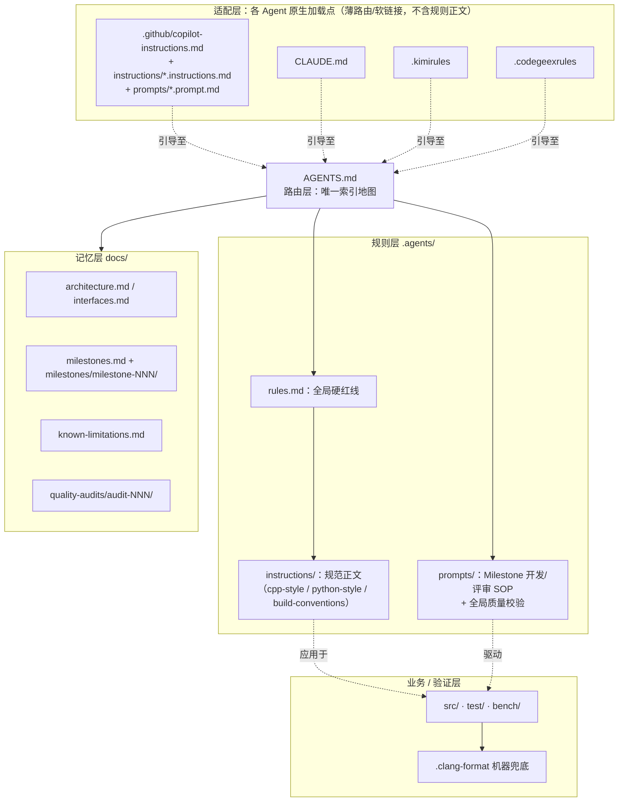
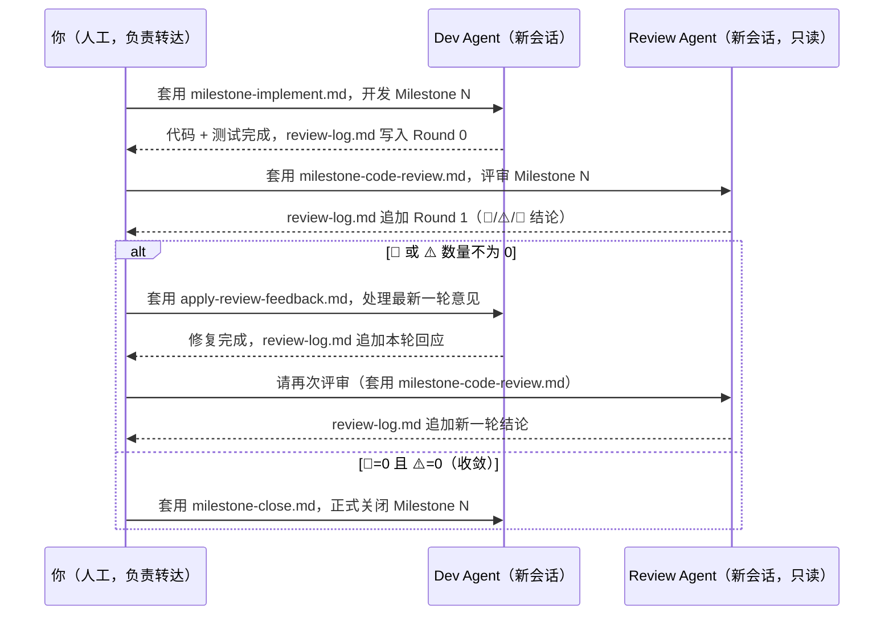
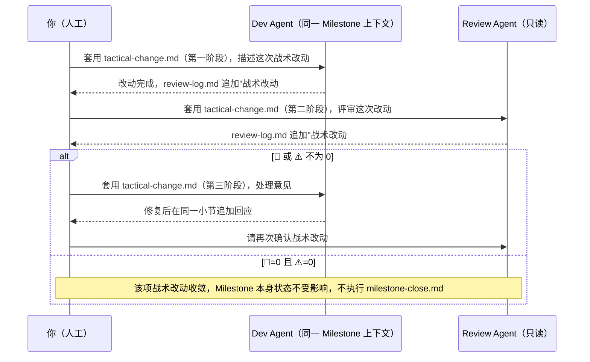
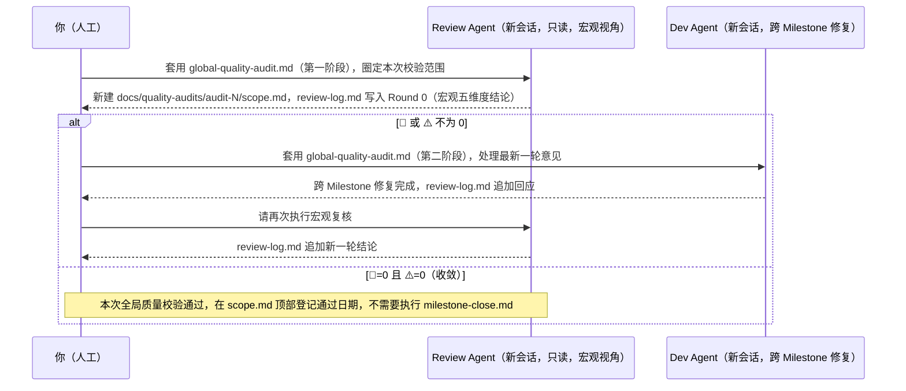

# AgenticScaffold

## 1. 要解决什么问题

大型工程（尤其是 C++ 这类强规范、强性能约束的语言）在引入 AI Agent 辅助开发后，常见以下问题：

1. **上下文断裂**：Agent 会话之间没有记忆，容易重复踩同一个坑、重复问同样的问题，甚至忘记项目已有的架构约束。
2. **多 Agent 规则漂移**：Copilot / Claude / Kimi / GLM / Codex 等不同工具各自有专属的配置文件约定，规则写多份容易改一处漏一处，写一份又覆盖不到所有工具。
3. **自由发挥导致不合规**：项目通常有明确的编码规范、架构分层、接口契约，但 Agent 容易"自由发挥"，生成风格不一致、过度设计，或者违反既有接口约定的代码。
4. **审查失真**：让 Agent 独立完成任务后直接采信风险很高，需要独立、客观的复核机制；但如果复核意见单纯靠人工反复转述，效率低且容易在转述中失真、遗漏。

**AgenticScaffold** 是一个可复制、可迁移的**样板仓库**：通过标准化的上下文路由、分层治理规则及开发 SOP，让任意一个 Agent（无论使用哪家厂商的工具）进入仓库后都能快速、准确地获取"该读什么、该遵守什么规则、该按什么流程做事"，把 Agent 的产出稳定在一个可预期、可审查、可复现的轨道上，以**准确、稳定、高效**完成复杂工程任务为最高目标。

## 2. 解决思路

- **分层隔离，职责单一**：路由层（`AGENTS.md`）只做索引，不重复正文；规则层（`.agents/`）分"极简红线触发器"（`rules.md`）与"完整规则正文"（`instructions/`）两级，避免一次性把所有规则灌给 Agent 撑爆上下文；记忆层（`docs/`）承载随项目演进持续更新的"活记忆"；适配层（`.github/`、`CLAUDE.md`、`.kimirules`、`.codegeexrules`）只负责把同一份规则"翻译"给不同工具各自的加载机制。
- **唯一权威源 + 软链接复用**：任何规则/流程模板只在 `.agents/` 下维护一份物理文件，其余工具专属入口都以软链接指向它（如 `.github/instructions/cpp.instructions.md -> .agents/instructions/cpp-style.md`），从物理上杜绝"改了一处忘了改另一处"的规则漂移。
- **设计先行，把决策从 Agent 的即兴发挥中剥离出来**：系统设计文档（问题定义/设计思路/建模方法/模块划分/核心接口）与开发计划（Milestone 拆分）在正式编程前就需要确定，这里Agent不负责设计决策只在既定约束下进行代码实现。
- **Dev/Review 双 Agent 收敛循环，以文件而非人工转述作为通信媒介**：每个开发任务都有独立的实现 Agent 与只读评审 Agent，评审意见与处理回应都写进同一份 `review-log.md`；人工只负责触发/转达"请看最新一轮"，不需要手工搬运内容；收敛判定也是客观的（🚨=0 且 ⚠️=0），不依赖"感觉做完了"。
- **机器兜底，不完全依赖 Agent 自觉**：能用 `.clang-format` 等工具强制的部分（如缩进、大括号风格）交给工具，规则文档只承担工具管不到的部分（如访问控制策略、注释密度、命名习惯）。

## 3. 仓库架构

### 3.1 目录树

```
AgenticScaffold/
├── AGENTS.md                              # 【路由层】Agent 进门第一站，仓库的唯一索引地图
├── .agents/                               # 【规则层】唯一权威源，其余 Agent 的专属文件均为软链接
│   ├── rules.md                           # 全局硬红线触发器（极简）
│   ├── instructions/                      # 局部规则库（按目录精确挂载）
│   │   ├── cpp-style.md                   # C++ 编码规范
│   │   ├── python-style.md                # Python 编码规范（数值计算/优化计算类脚本与 repo）
│   │   ├── build-conventions.md           # CMake 构建脚本约定
│   │   └── dependency-policy.md           # 依赖变更提议机制（Dependency Proposal SOP）
│   └── prompts/                           # 标准化工作流 Prompt 模板（Milestone 开发/评审闭环）
│       ├── milestone-implement.md
│       ├── milestone-code-review.md
│       ├── apply-review-feedback.md
│       ├── milestone-close.md
│       ├── tactical-change.md             # Milestone 内的战术级改动（不计入整体收敛判断）
│       ├── global-quality-audit.md        # 可选：所有 Milestone 分阶段完成后的宏观质量校验
│       ├── milestone-archive.md           # 可选：大型/长期项目的阶段归档（人工触发 + 定稿）
│       └── debug-circuit-breaker.md       # 同一 Bug 连续修复 3 次失败后的熔断流程
├── .github/                               # 【适配层】薄适配，Copilot 专属入口
│   ├── copilot-instructions.md            # 只做路由，引导至 AGENTS.md
│   ├── instructions/                      # 软链接 -> .agents/instructions/*
│   └── prompts/                           # 软链接 -> .agents/prompts/*（斜杠命令）
├── .kimirules                             # 【适配层】薄适配，Kimi 专属入口（单文件，不支持按路径自动加载）
├── .codegeexrules                         # 【适配层】薄适配，GLM / CodeGeeX 专属入口（同上）
├── CLAUDE.md                              # 【适配层】薄适配，Claude Code 专属入口（支持子目录层级合并）
├── docs/                                  # 【记忆层】外挂大脑
│   ├── architecture.md                    # 系统设计文档：问题定义/设计思路/建模/模块划分
│   ├── interfaces.md                      # [高频] 核心接口契约冻结清单（链接到实际头文件）
│   ├── milestones.md                      # [高频] Milestone 列表与状态机
│   ├── milestones/                        # 每个 Milestone 的任务书与评审记录（3 位数字编号，如 milestone-001）
│   │   ├── milestone-001/
│   │   │   ├── spec.md                    # 任务书：范围/交付物/验收标准
│   │   │   └── review-log.md              # Dev/Review 两个 Agent 的隔空对话记录
│   │   └── phases/                        # 可选：大型/长期项目的阶段归档小结（默认不存在，见 4.6 节）
│   │       └── phase-1-xxx.md
│   ├── quality-audits/                    # 可选：跨 Milestone 的宏观质量校验记录（默认不存在，见 4.5 节）
│   │   └── audit-001/
│   │       ├── scope.md                   # 本次校验覆盖的 Milestone 范围与触发原因
│   │       └── review-log.md              # Review Agent 宏观评审 + Dev Agent 跨 Milestone 修复的隔空对话记录
│   ├── known-limitations.md               # [高频] 避坑指南与边界条件记录
│   ├── numerical-notes.md                 # 调试手记（如精度、容差专题）
│   └── glossary.md                        # 统一术语表，消除命名幻觉
├── src/                                   # 【业务层】核心业务代码
├── test/                                  # 【验证层】单元测试（*.t.cpp），TDD 契约
├── bench/                                 # 【验证层】性能压测（bench_*.cpp + main.bench.cpp）
└── .clang-format                          # 机器兜底：格式化约束
```

### 3.2 分层关系



### 3.3 各文件/目录的作用

**路由层**

| 文件 | 作用 |
|---|---|
| `AGENTS.md` | 唯一索引地图，所有 Agent 进入仓库后第一个要读的文件；只做路由，不含规则正文 |

**规则层 `.agents/`（唯一权威源）**

| 文件 | 作用 |
|---|---|
| `rules.md` | 全局硬红线（极简触发器），命中场景后指引去读完整规则 |
| `instructions/cpp-style.md` | C++ 编码规范正文 |
| `instructions/python-style.md` | Python 编码规范正文（数值计算/优化计算类脚本与 repo） |
| `instructions/build-conventions.md` | CMake 构建脚本约定 |
| `instructions/dependency-policy.md` | 依赖变更提议机制：新增第三方依赖前必须输出 Dependency Proposal，等人类批准 |
| `prompts/milestone-implement.md` | Dev Agent 首次实现某 Milestone 的标准流程 |
| `prompts/milestone-code-review.md` | Review Agent 五维度只读评审的标准流程 |
| `prompts/apply-review-feedback.md` | Dev Agent 处理评审意见的标准流程 |
| `prompts/milestone-close.md` | 收敛后正式关闭 Milestone 的标准流程 |
| `prompts/tactical-change.md` | Milestone 内战术级改动的 Dev/Review 流程，不计入 Milestone 整体收敛判断 |
| `prompts/global-quality-audit.md` | 可选：所有/一批 Milestone 分阶段完成后的宏观质量校验，Review Agent 跨 Milestone 只读审查 + Dev Agent 跨 Milestone 修复，结果写入 `docs/quality-audits/audit-NNN/` |
| `prompts/milestone-archive.md` | 可选：大型/长期项目的阶段归档流程，Agent 只读起草 + 人工定稿 |
| `prompts/debug-circuit-breaker.md` | 同一 Bug/测试用例连续修复 3 次失败后的熔断流程，回退代码 + 输出尸检报告 |

**适配层（各 Agent 专属入口，均为薄路由或软链接）**

| 文件 | 对应 Agent | 说明 |
|---|---|---|
| `.github/copilot-instructions.md` | GitHub Copilot | 全局自动加载的薄路由 |
| `.github/instructions/*.instructions.md` | GitHub Copilot | 软链接，按路径（`applyTo`）自动挂载对应规范 |
| `.github/prompts/*.prompt.md` | GitHub Copilot | 软链接，斜杠命令调用 Milestone 流程模板 |
| `CLAUDE.md` | Claude Code | 根级薄路由，该工具原生支持按目录层级自动合并多个 `CLAUDE.md` |
| `.kimirules` | Kimi | 根级单文件，不支持按路径自动加载 |
| `.codegeexrules` | GLM / CodeGeeX | 同上 |
| （无需文件） | ChatGPT / OpenAI Codex | 原生读取 `AGENTS.md`，无需额外适配 |

**记忆层 `docs/`（外挂大脑）**

| 文件 | 作用 |
|---|---|
| `architecture.md` | 系统设计文档：问题定义、设计思路、建模方式、模块划分 |
| `interfaces.md` | 核心接口契约冻结清单（只登记设计意图与头文件链接，不重复代码） |
| `milestones.md` | Milestone 列表与状态机总览，顶部登记「当前 Milestone（默认编号指针）」，供各 Prompt 模板在人工未显式指定编号时自动取用，避免每次手动改写 `N` |
| `milestones/milestone-NNN/spec.md` | 单个 Milestone 的任务书（范围/交付物/验收标准） |
| `milestones/milestone-NNN/review-log.md` | Dev Agent 与 Review Agent 的收敛记录（隔空对话载体） |
| `milestones/phases/*.md` | 可选：阶段归档小结，仅在执行过 `milestone-archive.md` 后出现 |
| `quality-audits/audit-NNN/scope.md` | 可选：单次全局质量校验的覆盖范围（Milestone 区间/触发原因），仅在执行过 `global-quality-audit.md` 后出现 |
| `quality-audits/audit-NNN/review-log.md` | 可选：该次全局质量校验中 Review Agent 宏观评审与 Dev Agent 跨 Milestone 修复的隔空对话记录 |
| `known-limitations.md` | 已知坑与边界条件，避免重复踩雷 |
| `numerical-notes.md` | 数值精度/容差专题笔记（占位，待实际项目补充） |
| `glossary.md` | 统一术语表（占位，待实际项目补充） |

**业务 / 验证层**

| 目录 | 作用 |
|---|---|
| `src/` | 核心业务代码 |
| `test/` | 单元测试（命名 `*.t.cpp`），TDD 契约 |
| `bench/` | 性能压测（命名 `bench_*.cpp` + `main.bench.cpp`） |
| `.clang-format` | 格式化机器兜底，覆盖规范中可自动化的部分 |

## 4. 使用指南

### 4.1 如何基于本模板创建新仓库

1. 新建一个空白仓库。
2. 将本仓库中**除 `README.md` 之外**的所有文件（含隐藏文件 `.agents/`、`.github/`、`.kimirules`、`.codegeexrules`、`CLAUDE.md`、`.clang-format` 等）拷贝过去——`README.md` 描述的是"这个模板本身"，新项目应该写自己的 README。
3. 打开新仓库的 `AGENTS.md`，把"这是什么仓库"一节的占位文字替换为实际项目的一句话定位。
4. 检查 `.agents/instructions/cpp-style.md` 中"语言标准"一节锁定的 C++ 版本是否符合新项目需求（默认 C++17，可按需修改）。
5. 如果开发环境是 Windows，克隆前请确认 `git config --global core.symlinks true` 已开启（见第 5 节说明），否则软链接文件会变成失效的纯文本文件。

### 4.2 开发前的准备工作

正式编码前，先与你使用的 Agent（或人工）讨论产出以下文档，并落盘到位：

| 产出物 | 落盘位置 | 内容要点 |
|---|---|---|
| 系统设计文档 | `docs/architecture.md` | 问题定义、设计思路、抽象建模、模块划分 |
| 核心接口契约 | `docs/interfaces.md` | 关键抽象类/纯虚接口的设计意图 + 指向实际头文件的链接（不重复代码） |
| 开发计划（Milestone 拆分） | `docs/milestones.md`（总览）+ 每个 `docs/milestones/milestone-NNN/spec.md`（详情） | 每个 Milestone 的范围、交付物（业务代码/单元测试/可选 benchmark）、验收标准、前置依赖 |

以上三项是**正式开工前**需要人工（或与 Agent 讨论后）确定的设计类产出物。新增 Milestone 时的目录创建与 `docs/milestones.md` 登记，**不需要人工提前手动做**——Dev Agent 在套用 `.agents/prompts/milestone-implement.md` 开发某个 Milestone 时，若发现对应目录不存在会自动复制 `docs/milestones/milestone-001/` 模板并登记状态，人工只需要在启动 Dev Agent 时说清楚这次要做的范围即可。

### 4.3 开发一个 Milestone 的标准流程

核心流程是"Dev Agent 实现 → Review Agent 只读评审 → 未收敛则打回处理 → 收敛后关闭"，人工只负责在两个 Agent 会话之间转达"去看 `review-log.md` 最新一轮"，不需要手动转述评审内容：



> 以下示例开场白均省略了具体的 Milestone 编号：各 Prompt 模板会先读取 `docs/milestones.md` 顶部「当前 Milestone（默认编号指针）」作为默认编号 `N`，无需每次手动写明或来回改写；只有当你要临时处理非当前编号的 Milestone 时，才需要在开场白里显式指定编号覆盖默认值（如「针对 milestone-006 …」）。

**给 Dev Agent 的示例开场（新开一个会话）**：

```
请阅读 AGENTS.md，然后套用 .agents/prompts/milestone-implement.md 完成当前 Milestone 的开发。
```

**给 Review Agent 的示例开场（另开一个会话）**：

```
请阅读 AGENTS.md，然后套用 .agents/prompts/milestone-code-review.md 对当前 Milestone 的开发结果进行评审。
```

**若未收敛，回到 Dev Agent 会话**：

```
Review Agent 已给出新一轮意见，请查看 review-log.md 最新一轮，套用 .agents/prompts/apply-review-feedback.md 处理。
```

**处理完成后，回到 Review Agent 会话**：

```
Dev Agent 已处理完毕，请查看 review-log.md 最新一轮回应，套用 milestone-code-review.md 再次评审。
```

**收敛后，关闭 Milestone**：

```
review-log.md 最新一轮 🚨=0 且 ⚠️=0，请套用 .agents/prompts/milestone-close.md 关闭当前 Milestone。
```

**战术级别的局部改动不需要单独立项**：例如"优化某个热点函数""把一个大函数拆分成多个小函数"这类改动，本质上是某个 Milestone 内部的执行细节，不是新的战略目标，不要为此新建目录或走一整套流程。处理原则：
- 如果这次改动会影响所在 Milestone 的范围/验收标准/设计假设（战略级影响），由人工直接更新该 Milestone 的 `spec.md`（必要时同步 `docs/architecture.md`/`docs/interfaces.md`），把变更并入现有 Milestone。
- 如果只是战术层面的实现细节调整，不影响 Milestone 对外承诺的范围，走 4.4 节的轻量流程即可，不必强制生成新的独立记录——给开发者留出足够的战术自由度，避免把每一个函数级的小改动都变成一次正式流程。

### 4.4 处理 Milestone 内的战术级改动（示例：优化 ESDF 地图构建速度）

假设 Milestone 3 已经在开发或已完成，现在临时需要"优化基于栅格地图构建 ESDF 地图的速度"——这一点在 Milestone 3 的 `spec.md` 里没有明确列出，且不影响其对外承诺的范围/验收标准。这类改动套用 `.agents/prompts/tactical-change.md`，复用**同一个** Milestone 的 `review-log.md` 追加记录，而不是新建文件；其结论**不计入** Milestone 整体的收敛判断：



**给 Dev Agent 的示例开场**：

```
请阅读 AGENTS.md 与 docs/milestones/milestone-003/spec.md，然后套用 .agents/prompts/tactical-change.md（第一阶段）完成一次战术级改动：
优化基于栅格地图构建 ESDF 地图的速度，目标是构建耗时从 X ms 降到 Y ms，且现有单元测试全部保持通过。
这不在本 Milestone 的原始交付物清单里，不需要修改 spec.md，也不需要新建 Milestone。
```

**给 Review Agent 的示例开场**：

```
请阅读 AGENTS.md，然后套用 .agents/prompts/tactical-change.md（第二阶段），
对 docs/milestones/milestone-003/review-log.md 里最新的「战术改动 #1」进行评审。
```

**若有 🚨/⚠️，回到 Dev Agent 会话**：

```
Review Agent 已给出意见，请查看 review-log.md 中「战术改动 #1」最新回应位置，套用 tactical-change.md（第三阶段）处理。
```

收敛后（🚨=0 且 ⚠️=0），无需执行 `milestone-close.md`——这只是 Milestone 3 内部的一项战术改动，Milestone 本身的状态和交付物清单都不受影响。

### 4.5 全局质量校验：所有 Milestone 分阶段完成后的宏观复核

前面几节的 Dev/Review 循环（包括战术改动）都是**以单个 Milestone 为责任边界**的：Review Agent 只对照该 Milestone 的 `spec.md` 与它这一次的代码 diff 负责，天然看不到"这个 Milestone 引入的代码是否和另一个 Milestone 早先引入的代码重复""架构是否在多个 Milestone 的持续演进中悄悄漂移了""全局测试/构建是否依然健康"这类跨 Milestone 才能观察到的问题。项目积累到一定数量的已完成 Milestone 后，仅靠逐个 Milestone 收敛不能替代一次面向**整个代码库当前状态**的体检。

**触发时机**：由人工判断，不要求每个 Milestone 关闭后都执行（否则会退化成"每个 Milestone 多审一遍"，增加成本却收益有限）。建议在下列场景触发：
- 一批相关 Milestone（如围绕同一个子系统）全部标记为「已完成」之后；
- 重大版本发布 / 对外交付前的最终体检；
- 距离上一次全局质量校验已经过了较长时间或较多 Milestone，人工主观感觉"该做一次整体体检了"。

**与 Milestone 级评审的关键区别**：

| 维度 | Milestone 级评审（4.3 节） | 全局质量校验（本节） |
|---|---|---|
| 审查对象 | 单个 Milestone 的代码 diff | 整个代码库的当前状态（`src/`、`test/`、`bench/`） |
| 责任边界 | 对照该 Milestone 的 `spec.md` | 对照 `docs/architecture.md`/`docs/interfaces.md` 与代码库整体一致性 |
| 记录位置 | `docs/milestones/milestone-N/review-log.md` | `docs/quality-audits/audit-N/{scope.md,review-log.md}` |
| 收敛后动作 | 套用 `milestone-close.md` 关闭该 Milestone | 在 `scope.md` 登记通过日期，不影响任何 Milestone 自身状态 |
| 触发频率 | 每个 Milestone 一次（含多轮复审） | 按阶段性节点触发，不要求每个 Milestone 都做一次 |

**工作流**：与 Milestone 级评审顺序相反——全局质量校验是**先由 Review Agent 做宏观只读审查**（因为代码已经存在，不需要"先实现"），发现问题后再由 Dev Agent 跨 Milestone 修复，如此循环直至收敛：



宏观审查沿用 🚨 阻断 / ⚠️ 严重 / 📝 建议 的三级分类，但审查维度换成跨 Milestone 视角的五项：架构一致性、接口契约完整性、跨模块重复与耦合、全局构建与测试健康度、技术债务收敛情况（具体定义见 [.agents/prompts/global-quality-audit.md](.agents/prompts/global-quality-audit.md)）。

> 与 Milestone 开发流程类似，`audit-{N}` 的编号不需要人工在对话中手动指定：新起一轮校验时，Agent 自动取 `docs/quality-audits/` 下已有最大编号 + 1；续接处理/复核一次已经发起的校验时，Agent 自动定位编号最大的现有目录。只有当人工明确要求"重新开始新一轮"或"针对更早的历史 audit 目录"时，才需要显式指定编号（详见 [.agents/prompts/global-quality-audit.md](.agents/prompts/global-quality-audit.md) 的"编号确定规则"）。

**给 Review Agent 的示例开场（第一阶段，新开一个会话）**：

```
请阅读 AGENTS.md，然后套用 .agents/prompts/global-quality-audit.md 对整个代码库做一次全局质量校验。
本次覆盖范围：docs/milestones.md 中所有已标记「已完成」的 Milestone。
触发原因：这批 Milestone 完成的 xxx 已经收尾，需要一次跨 Milestone 的整体体检。
```

**若有 🚨/⚠️，给 Dev Agent 的示例开场（第二阶段，另开一个会话）**：

```
请阅读 AGENTS.md，然后套用 .agents/prompts/global-quality-audit.md 处理最新一次全局质量校验 review-log.md 最新一轮意见。这次修复可能跨越多个 Milestone 涉及的文件，请按问题实际影响范围处理，不要局限于某一个Milestone。
```

**处理完成后，回到 Review Agent 会话请求复核**：

```
Dev Agent 已处理完毕，请查看最新一次全局质量校验 review-log.md 最新一轮回应，套用 global-quality-audit.md 再次执行宏观复核。
```

**收敛后（🚨=0 且 ⚠️=0）**：

```
在 scope.md 顶部登记"本次全局质量校验已通过，日期：xxx"即可，不需要、也不应该执行 `milestone-close.md`——这不是某个 Milestone 的收尾动作，不影响 `docs/milestones.md` 中任何一个 Milestone 的状态。
```

### 4.6 规模化：可选的阶段归档（大多数项目不需要）

本节针对**长生命周期、多人团队**的场景，比如一个 10 人团队持续维护 4 年的 repo：第一年主力开发阶段 Milestone 可能细到按天拆分，累积几十上百个；后续维护阶段可能改为按周拆分，数量大幅减少。这种情况下 `docs/milestones.md` 的一张扁平大表会读不动。

**默认情况下不需要处理这个问题**：如果项目规模有限（比如一个几十个 Milestone 后就基本稳定的工具库），`docs/milestones.md` + `docs/milestones/milestone-NNN/` 的扁平结构可以一直用到项目结束，不需要引入下面的机制。

当确实需要归档时（通常是一个自然的阶段边界，如"第一年主力开发已完成，进入维护期"），人工显式触发 [.agents/prompts/milestone-archive.md](.agents/prompts/milestone-archive.md)：

1. 人工说明本次归档范围（如"milestone-001 到 milestone-050 归入『第一年主力开发』阶段"）。
2. 这个只读的归档流程遍历该范围内每个 Milestone 的 `spec.md` + `review-log.md`，起草 `docs/milestones/phases/phase-1-xxx.md`（每个 Milestone 3~5 句摘要 + 链接回原始目录），以及 `docs/milestones.md` 的更新草案（把已归档区间收起为一行，未归档的继续按行展示）。
3. **人工校对定稿后才生效**——这是刻意设计的强制人工闸门，因为归档结果会成为"官方压缩后的历史记录"。
4. 归档过程**不会移动或删除**任何 `docs/milestones/milestone-NNN/` 原始目录/文件，只新增 `phases/*.md` 摘要文件，避免破坏 `docs/known-limitations.md`、`docs/interfaces.md` 变更记录等处已有的引用链接。

**给归档任务的示例开场**：

```
请阅读 AGENTS.md，然后套用 .agents/prompts/milestone-archive.md，把 milestone-001 到 milestone-050 归入
『第一年主力开发』阶段：起草 docs/milestones/phases/phase-1-initial-dev.md 和 docs/milestones.md 的更新草案，
不要移动或删除任何原始 Milestone 目录，草案完成后等待我校对定稿。
```

## 5. 其他需要注意的事项

- **符号链接在 Windows 上的坑**：本仓库大量使用符号链接（如 `.github/instructions/cpp.instructions.md`）避免规则重复。Git 默认在 Windows 上可能不创建真正的符号链接（`core.symlinks` 默认关闭），导致这些文件被 checkout 成"内容只有一行相对路径文本"的普通文件而失效。在 Windows 上使用前，请确认已执行 `git config --global core.symlinks true`（部分场景还需要开启开发者模式或以管理员身份运行）后再克隆/检出。WSL/Linux/macOS 下没有这个问题。
- **当前仍是模板，多处是占位内容**：`docs/architecture.md`、`docs/interfaces.md`（含两条接口示例）、`docs/milestones.md` 与 `docs/milestones/milestone-001/`（编号与名称都是占位）、`docs/glossary.md`（含一条示例术语）、`AGENTS.md` 的项目定位段落，在实际项目里都需要替换为真实内容。
- **只维护一套 Milestone 粒度的 SOP，战术级改动就地并入所在 Milestone**：本仓库没有为"单点小任务"单独设计一套流程——这类改动要么是所在 Milestone 的范围变更（更新该 Milestone 的 `spec.md`），要么是不影响对外承诺范围的执行细节（直接在该 Milestone 开发过程中处理，不强制记录），刻意不引入第二套编号/目录机制，避免管理成本超过收益。**4.5 节的全局质量校验是唯一的例外**：它解决的是"单点小任务"之外的另一个维度的问题——跨 Milestone 的宏观一致性，而不是某一次具体改动，因此单独使用 `docs/quality-audits/audit-NNN/` 编号目录，与本条约束的"单点小任务不另开目录"并不冲突。
- **新增其他 Agent 适配时的原则**：先确认该工具真实的仓库级配置文件约定（不确定时不要凭经验猜测文件名），再按"薄路由 + 引导读取 AGENTS.md / .agents/rules.md"的模式新增根级文件；如该工具支持路径级自动加载，再补充软链接指向 `.agents/instructions/` 或 `.agents/prompts/` 下的本体文件，不要复制正文。
- **规则变更只改一处**：修改 C++/Python/CMake 规范或 Milestone 流程模板时，只编辑 `.agents/instructions/`、`.agents/prompts/` 下的本体文件，所有工具专属入口都是软链接，会自动生效。
- **两条防御性红线**：为防止 Agent 常见的两类失控行为，`.agents/rules.md` 里额外规定了（1）不得未经批准擅自新增第三方依赖，必须先输出 Dependency Proposal 等人类回复"Approve proposal"（见 `dependency-policy.md`）；（2）同一个 Bug/测试用例连续修复 3 次仍失败时必须停止、回退代码、输出尸检报告等待人类介入，不得无限重试（见 `debug-circuit-breaker.md`）。这两条适用于任何任务场景，不局限于 Milestone 开发。
