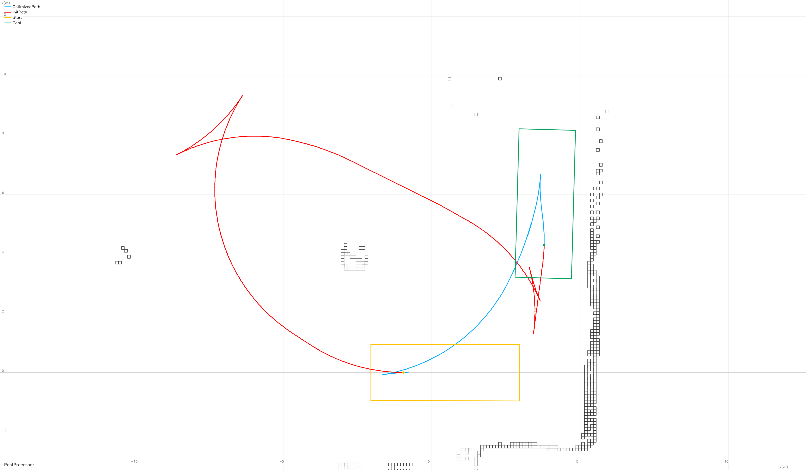
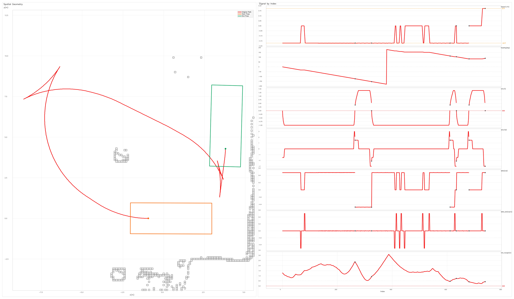
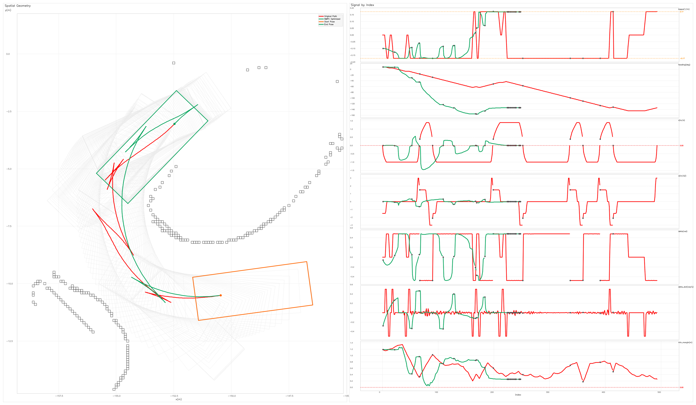
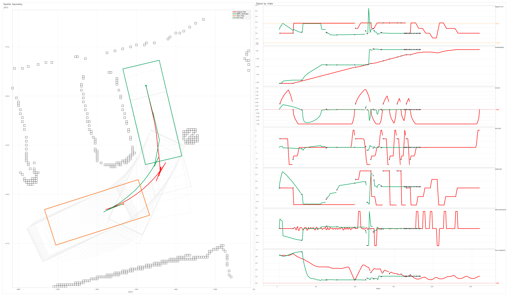
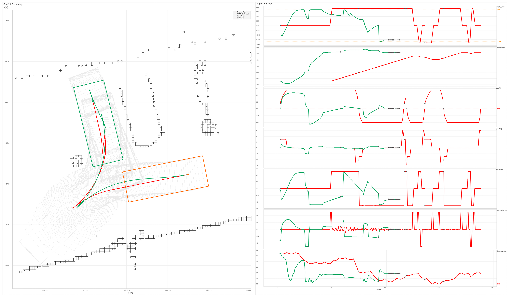

# APAPostProcessor

APA路径规划后处理器

## 1. 构建与运行

### 1.1. 环境要求

- **编译器**：支持 C++17 的 GCC（≥8）或 Clang（≥10）
- **CMake**：≥ 3.5
- **Ninja**（可选，推荐）：构建加速

### 1.2. 第三方依赖

| 依赖 | 安装方式 | 备注 |
|---|---|---|
| **Protobuf** | `apt install libprotobuf-dev protobuf-compiler` | 必须：版本需 ≥ 3.15（proto3 `optional` 关键字支持）；系统源内版本不足时（如 Ubuntu 22.04 及更早）需从 GitHub Releases 源码编译 |
| **OpenCV** | `apt install libopencv-dev` | 必须 |
| **Eigen3** | `apt install libeigen3-dev` | 必须 |
| **nlohmann\_json** | `apt install nlohmann-json3-dev` | 必须 |
| **OpenMP** | 随编译器安装（GCC/Clang 自带） | 必须 |
| **CasADi (Python)** | `pip3 install casadi`（用于 StcSQP 动力学 / 走廊 C 代码生成） | 必须 |
| **Python** | ≥ 3.8（CasADi 脚本需 `python3`） | 必须 |
| **GTest** | `apt install libgtest-dev` | 可选（无则跳过单元测试） |
| **Google Benchmark** | `apt install libbenchmark-dev` | 可选（无则跳过性能测试） |
| **ccache** | `apt install ccache` | 可选（编译缓存加速） |

以下库已内置在 `third_party/` 中，无需手动下载：

| 库 | 位置 | 用途 |
|---|---|---|
| **BLASFEO** | `third_party/blasfeo/` | 高性能线性代数（HPIPM 依赖） |
| **HPIPM** | `third_party/hpipm/` | 结构 QP 求解器（StcSQP 底层后端） |
| **StcSQP** | `third_party/StcSQP/` | SQP 数值优化框架 |
| **OSQP** | `third_party/osqp/` | 二次规划求解器 |
| **LBFGSpp** | `third_party/LBFGSpp/` | 无约束/箱式约束优化 |
| **Quill** | `third_party/quill/` | 异步日志库 |

### 1.3. 项目结构

```
.
├── src/            # 核心源码
│   ├── core/       # NMPC 求解器、后处理器
│   ├── preprocessing/  # 预处理管线（B样条/速度规划/走廊）
│   ├── spatial/    # ESDF 地图、网格
│   ├── util/       # 数据加载、日志、路径工具
│   └── vehicle/    # 车辆参数与覆盖模型
├── test/           # 单元测试（GTest）
├── bench/          # 性能基准（Google Benchmark）
├── tool/           # 辅助脚本
├── data/           # 测试数据集
├── docs/           # 设计文档
├── proto/          # Protobuf 协议定义
└── third_party/    # 第三方源码
```

### 1.4. 主程序运行方法

```bash
# Debug 版
./build/Debug/apa_post_processor

# Release 版
./build/Release/apa_post_processor
```

主程序的行为完全由 `data/config.json` 驱动，**无需重新编译**即可切换数据集与算法。
该文件只有两个字段：

```json
{
  "data_file_path": "data/rub_park/data1.json",
  "config_details_path": "data/alm_config.json"
}
```

| 字段 | 含义 | 可选值 |
|---|---|---|
| `data_file_path` | 输入数据集（车辆参数/栅格地图/初始路径的 protobuf JSON） | `data/rub_park/data1.json`、`data/rub_park/data7.json`、`data/mid_park/data3.json`、`data/long_park/data6.json`（`data/test.json` 为轻量调试数据仅用于单元测试） |
| `config_details_path` | 算法配置详情 JSON，**按约定每个算法一个** | `data/alm_config.json`（ALM 路径）、`data/nmpc_config.json`（NMPC 路径） |

切换算法的方法：只需把 `config_details_path` 改成另一个算法的配置文件。主程序启动时会读取该详情 JSON 中的 `"algorithm"` 字段（`"alm"` 或 `"nmpc"`），由 `PlanningScene::LoadFromFile` 工厂运行时路由到对应算法场景——例如对比同一数据集在两种算法下的效果时，先指向 `data/alm_config.json` 跑一遍，再改成`data/nmpc_config.json` 直接重跑即可，不用改动任何代码。算法详情 JSON 内还可覆盖
该算法的通用配置字段。

运行后产物：

- **优化摘要日志**：控制台与 `log/` 日志文件输出优化前后路径长度、机动段数变化与耗时（优化失败时输出失败原因）；
- **对比图**：`fig/` 下生成"原始路径（红）vs 优化轨迹（绿，标签带算法名）"的轨迹对比图（空间几何 + κ/heading/v/a/δ/δ̇/安全余量信号带）；原始路径的时间信息由最快走完前提的梯形加减速时间参数化补全。优化失败时只绘制初始轨迹。

### 1.5. 单元测试和性能基准测试运行方法

编译后运行

```bash
test_apa_post_processor
bench_apa_post_processor
```

---

## 2. ALM

详细设计文档见 [docs/ALM.md](docs/ALM.md)基于NMPC的方法优化 HybridA* 等方法生成的初始轨迹。在不同数据集上的优化效果如下表所示：

| 数据集 | 优化前后长度变化 | maneuver变化 | 耗时 | 收敛状态 |
|---|---|---|---|---|
| `data/long_park/data6.json` | 36.862→32.524m | 6→4 | 0.43s | 收敛 |
| `data/mid_park/data3.json` | 24.582→21.601m | 9→7 | 0.75s | 收敛 |
| `data/rub_park/data1.json` | 12.988→10.673m | 10→4 | 0.27s | 收敛 |
| `data/rub_park/data7.json` | 18.744→16.143m | 6→4 | 0.61s | 收敛 |

各场景优化前后对比（红色为经"最快走完"梯形时间参数化补全的原始路径，绿色为 ALM 优化后轨迹，顺序与上表一致）：

**long_park（`data/long_park/data6.json`）**：maneuver段数 6→4，长度缩短 11.8%：


**mid_park（`data/mid_park/data3.json`）**：maneuver段数 9→7，长度缩短 12.1%：


**rub_park data1（`data/rub_park/data1.json`）**：maneuver段数 10→4，长度缩短 17.8%：


**rub_park data7（`data/rub_park/data7.json`）**：maneuver段数 6→4，长度缩短 13.9%：


---

## 3. NMPC

详细设计文档见 [docs/NMPC.md](docs/NMPC.md)。基于NMPC的方法优化HybridA*等方法生成的初始轨迹，这里同样提供了三个场景四个用例，在每个用例中的表现如下：

| 数据集 | 优化前后长度变化 | maneuver变化 | 耗时 | 收敛状态 |
|---|---|---|---|---|
| `data/long_park/data6.json` | 36.862→36.836m | 6→6 | 5.3s | 求解失败，回退到预处理轨迹 |
| `data/mid_park/data3.json` | 24.582→20.882m | 9→7 | 7.1s | 收敛 |
| `data/rub_park/data1.json` | 12.988→10.594m | 10→8 | 2.8s | 收敛 |
| `data/rub_park/data7.json` | 18.744→18.099m | 6→5 | 8.2s | 未完全收敛，使用末迭代解 |

**long_park**：长距离泊车场景，数据集为 `data/long_park/data6.json`。若仅以 ESDF 距离场的距离合法性作为约束把碰撞安全以软惩罚形式计入优化目标，优化器在几何上允许跨越障碍物，即不局限于初始路径所在的同伦类，理论上可以收敛到全局最优解。下图中红色轨迹为初始路径，蓝色轨迹为该设置下的优化结果：



然而，这一自由度是有代价的：软约束仅在求解收敛的前提下才能保证无碰撞，一旦优化未能收敛，中间迭代轨迹便可能与障碍物发生碰撞，甚至卡死于障碍物内部。出于"未收敛情形下也必须保证安全"的工程考虑，我们主动舍弃了这一自由度，改为引入迭代走廊硬约束，将优化空间尽可能限制在初始路径的同伦类内。其代价在本场景中同样直观：优化器无法再从障碍物右侧绕行，优化失败：



**mid_park**：中等距离泊车场景，数据集为 `data/mid_park/data3.json`，同样的这里的红色轨迹为初始轨迹，绿色轨迹为优化后的轨迹，这里的灰色轮廓为车辆沿着优化后轨迹移动形成的采样轮廓，可以看到在这个场景中成功实现了maneuver段数的削减：



**rub_park**：这里有两个数据集，分别为 `data/rub_park/data1.json` 和 `data/rub_park/data7.json`。可以看到在下面的data1场景中虽然maneuver段数也有削减但是最后两段不够平滑，主要是因为这里的优化目标设置中尽快到达终点的权重较大：



data7中的效果如下图所示，maneuver段数由原来的6段削减为5段：


