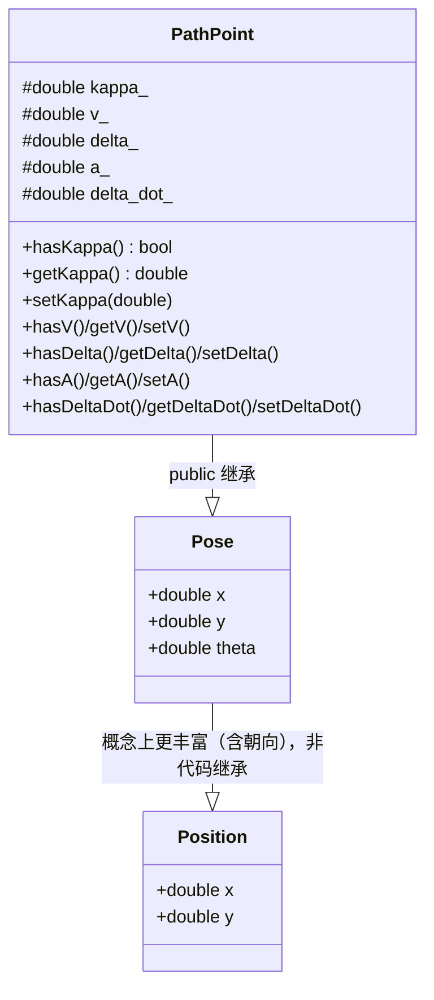
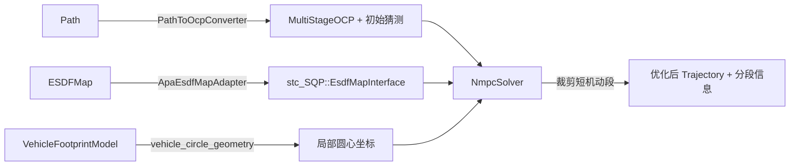
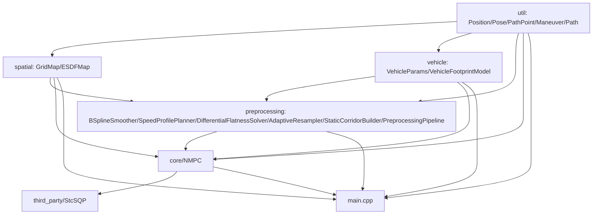
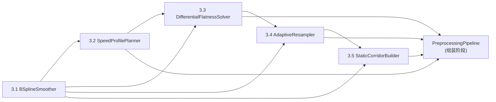

# 系统设计文档

## 1. 问题定义

APAPostProcessor 是一个 **APA（Automated Parking Assist，自动泊车辅助）路径规划后处理器**：
输入上游路径搜索模块（如 Hybrid A*）产出的一条粗糙泊车路径、占据栅格环境与车辆物理参数，
输出一条经过平滑、满足车辆运动学约束、且与环境保持安全裕度的可执行轨迹。

明确边界（不做什么）：

- 不做感知、定位、地图构建：环境以离线的占据栅格（`GridMap`）形式给定。
- 不做上游路径搜索（不实现 Hybrid A* 等前端规划器），只接收其产出的初始 `Path` 作为输入。
- 不做实时闭环控制执行：输出的是离线优化后的轨迹，不负责下发给车辆控制器。
- 不做多种后处理算法的运行时切换框架：当前仓库聚焦"实现并比较不同后处理算法在同一场景下的表现"，
  各算法之间是并列的实现（详见第 4 节模块划分），而非插件式运行时策略。

## 2. 设计思路

整体是一条**分层流水线**：

1. **数据加载**：从 json 配置 + protobuf（`proto/apa_post_process.proto`）反序列化出车辆参数、
   环境栅格与初始路径（`util/data_loader.hpp` + 各数据结构的 `FromProto`）。
2. **环境建模**：占据栅格 `GridMap` → 连续符号距离场 `ESDFMap`（双线性插值 + 梯度），
   为后续碰撞约束/代价提供可微分的距离查询。
3. **车辆几何建模**：`VehicleParams`（物理参数）→ `VehicleFootprintModel`
   （用多个圆近似车辆内外轮廓，按航向角离散化为查找表），把非凸的车身多边形碰撞检测
   转化为多个"点到最近障碍物距离"查询，兼顾精度与求解效率。
4. **路径表示与预处理**：初始路径被组织为 `Path`（有序 `Maneuver` 序列，`Maneuver` 内部是
   同一运动方向下的 `PathPoint` 序列）。`Path::addPoint` 在插入时自动完成：
   过近点去重、超距点线性插值、前进/后退/原地转向的方向推断；曲率估计则延后到
   `finalize()` 中统一批量完成。
5. **NMPC 优化**：核心后处理算法之一，复用 `third_party/StcSQP`（一个与业务无关的通用 SQP/OCP
   数值优化引擎）。业务层只负责"物理语义 → 数值参数"的转换：
   - `PathToOcpConverter` 把 `Path` 转成 `MultiStageOCP` 描述 + 初始猜测轨迹；
   - `ApaEsdfMapAdapter` 把 `ESDFMap` 适配成 StcSQP 的 `EsdfMapInterface`；
   - `vehicle_circle_geometry::ExtractLocalCircleCenters` 把 `VehicleFootprintModel` 的圆心
     转成 StcSQP 碰撞约束所需的局部坐标；
   - `NmpcSolver` 编排整个求解流程，并在求解后执行机动段裁剪（合并 Hybrid A* 产生的冗余换挡）。
6. **可视化/导出**：`Visualizer` 用于调试期绘制路径、车辆轮廓等；结果最终可通过 `Path::toProto`
   导出。针对预处理管线（第 5 步 5 个阶段）自身的排障需求，`Visualizer` 另外提供一个
   面向管线全断面的诊断入口 `plotPipelineDiagnostics`：把此前封装在
   `PreprocessingPipeline::run` 局部变量中、执行完即销毁的各阶段中间产物（B 样条密集配点、
   逐点速度/加速度/转角/转角速度、重采样时间步长、静态走廊松弛量）按需透传出来，以
   2 行 3 列子图统一在同一物理弧长/索引轴上平行对比，替代此前只能靠打印日志或单独写
   一次性脚本排查管线内部数值问题的方式。该能力默认关闭（`enable_debug_output = false`），
   仅在显式开启时填充调试数据，不影响生产路径的内存占用，详见
   [docs/visualizer_for_preprocessing_pipeline.md](visualizer_for_preprocessing_pipeline.md) 完整设计。

关键设计取舍：

- **复用通用数值优化引擎而不重复造轮子**：StcSQP 对物理世界"一无所知"，只认识固定维度的矩阵/参数
  向量；所有泊车业务语义都在 `src/core/NMPC/` 里以"适配器"的形式单向注入，避免把业务概念污染进
  通用优化内核。
- **多圆近似代替精确多边形碰撞检测**：用有限个圆到最近障碍物的距离约束/代价近似车身占据区域，
  在数值优化中可微、计算量可控。
- **碰撞约束用软代价而非硬约束**：真实数据的初始猜测可能已经贴着障碍物（甚至瞬时违反安全裕度），
  硬约束会导致 QP 在第 0 次迭代就因不可行而直接求解失败；软代价保证可行域非空，只是违反时支付
  高额代价（详见 `NmpcSolverConfig::esdf_penalty_weight` 注释）。
- **路径的方向切分与曲率完全由 `Path` 自己用几何启发式推导**（纵向投影 + 外接圆法），不依赖
  上游标注，因为上游 Hybrid A* 等前端不保证提供这些信息、且格式可能不统一。
- **"位姿"与"路径点"是两个不同的领域概念，不应该用同一个类型承担**：`Pose` 是任意时刻/任意场景下
  的几何位姿（车辆瞬时位姿、可视化标注等），`PathPoint` 才是"路径规划输出的轨迹点"，多出的曲率
  `kappa` 是 `Path` 对外的派生量而非通用位姿属性。这一区分是 2026-07-06 讨论后确立的重构目标，
  详见第 3 节。
- **碰撞安全裕度已移除，改为纯数值容差**：外圆（Outer Circles）本身已超出车辆矩形轮廓边界，因此全管线统一移除物理安全裕度（原 5cm/8cm），改为仅使用数值容差（`kCollisionEpsilon = 1e-6`）兜底浮点误差。NMPC 软舒适约束（18cm）独立保留，用于降低乘员压迫感。详见 [docs/NMPC.md](NMPC.md) 3.1 节"碰撞检测数值容差的设计原则（2026-07-10 重大更新）"。
- **`third_party/StcSQP` 按第三方依赖对待的原则存在一处显式例外**：第 4 节模块划分表已注明该引擎
  "不计入本仓库业务代码规范"，但 3.5 节所述的一段专项内部工程优化需要直接修改其内部实现以提升
  NMPC 求解性能。这类改动不修改其对外的 `MultiStageOCP`/`SQPSolver` 使用方式，且必须同步更新
  `third_party/StcSQP/design_document.md`/`AGENTS.md`（该框架自身的权威文档），因此按本仓库的
  常规变更流程跟踪、但不改变"StcSQP 内部编码风格由其自身 `AGENTS.md` 治理"这一前提——两边
  文档都要改，不能只登记在一处。
- **去虚拟化方案选 `std::variant` 而非 CRTP**：复核 acados（业界成熟 SQP/OCP 框架）架构后发现，其
  "零开销热循环"依赖的是离线 CasADi 代码生成（把具体问题在生成期固化为专属 C 代码），而非 C++
  模板；其运行时仍保留可配置的 module 类型选择（函数指针分发，与虚函数开销量级相当）。CRTP 要求
  某个位置的具体类型在编译期唯一确定，这与本仓库"运行时任意组合 box/corridor/ESDF 等约束类型、
  比较不同场景表现"的定位（见第 1 节）直接冲突；`Constraint`/`CostTerm` 的具体子类目前是一个很小的
  封闭集合（约束 4 个、代价 3 个），改用 `std::variant` + `std::visit` 能在保留运行时组合能力的同时，
  让编译器对分发出的具体类型函数体做完整内联，收益与 CRTP 同量级但改动面小得多。该方案已实际
  实现并 benchmark，但未观测到可解释的性能收益，最终评估结论为不采纳，详见 [docs/interfaces.md](interfaces.md) 与 [docs/known-limitations.md](known-limitations.md) 对应记录。

## 3. 抽象建模

### 3.1 基础几何类型的层次

- `Position`：二维坐标，用于占据栅格/ESDF 的原点、栅格中心等纯位置场景。
- `Pose`：位置 + 朝向 `theta`，代表"某一时刻的几何位姿"，例如可视化中车辆的瞬时姿态。
  用 `struct` 声明、字段全公开，代表这三个量**必然存在**，**不应该包含任何路径规划语境下
  才有意义的派生量**（如曲率、速度）。
- `PathPoint`：`public` 继承 `Pose`，新增一组**不一定存在**的派生量：
  - `kappa`（有向曲率，1/m）：唯一权威来源是 `Path` 内部的曲率估计算法（外接圆法）；
  - `v`（纵向速度，m/s）、`delta`（前轮转角，rad）：对应 NMPC 优化轨迹的状态量；
  - `a`（纵向加速度，m/s²）、`delta_dot`（前轮转角变化率，rad/s）：对应 NMPC 优化轨迹的
    控制量（每段最后一个点通常没有对应的控制量）。

  这些派生量默认值均为 `std::numeric_limits<double>::quiet_NaN()`（代表"尚未提供"，不用
  `0.0` 兼任哨兵值），且不裸露字段，只能通过 `hasXxx()`/`getXxx()`/`setXxx()` 三件套访问：
  `hasXxx()` 判断是否已设置，`getXxx()` 未设置时抛出 `std::logic_error`（未检查 `has` 就
  `get` 视为调用方逻辑错误）。`PathPoint` 用 `class`（而非 `struct`）声明并把这些字段放在
  `protected`，与 `Pose` 的 `struct` 全公开字段形成对比——用不同的语言机制表达
  "必然存在"与"不一定存在"这两种不同的存在性语义。

  proto 层（`proto/apa_post_process.proto`）中 `Path`/`Maneuver` 携带的点始终只使用
  `apa::post_processor::Pose`（`x`/`y`/`theta`），不新增字段承载这些派生量——它们只在
  C++ 进程内产生和消费，不需要持久化或跨进程传递。`Path::FromProto`/`toProto` 负责在
  `Pose`（proto 反序列化产物）与 `PathPoint`（`Path`/`Maneuver` 的内部存储类型）之间转换。

### 3.2 路径与机动段

- `Maneuver`：同一运动方向（`Direction::FORWARD`/`BACKWARD`/`PIVOT`/`UNKNOWN`）下的
  `PathPoint` 有序序列，是 `Path` 的最小分段单元。
- `Path`：`Maneuver` 的有序序列。对外提供基于"逐点追加"的构造方式（`addPoint`），内部维护：
  - 去重/插值：过近的点忽略，过远的点线性插值补点；
  - 方向推断：基于纵向投影与位移阈值，推断当前点相对上一参考点是前进/后退/原地转向；
  - 曲率估计：基于外接圆法，在一个滑动的距离窗口内取前后参考点计算有向曲率。**计算时机在
    所有点追加完成后，由 `finalize()` 统一批量完成**（而非 `addPoint()` 时增量刷新），
    避免"草稿曲率/最终曲率"两套状态并存的复杂度；`addPoint()` 追加的点在 `finalize()`
    之前 `hasKappa() == false`。

### 3.3 环境与车辆几何

- `GridMap`：离散占据栅格（0/1），提供物理坐标 ↔ 栅格索引的双向映射。
- `ESDFMap`：基于 `GridMap` 构建的欧式符号距离场（Felzenszwalb & Huttenlocher 算法），
  对外提供任意物理坐标处的符号距离与梯度（双线性插值），供 NMPC 碰撞约束/代价使用。
- `VehicleParams`：车辆物理参数（长宽轴距、最大转向角等），并派生出最大曲率 `max_kappa`。
- `VehicleFootprintModel`：把车身用内圈（保守近似，供内缩/软代价场景）与外圈
  （完整覆盖车身，供硬碰撞安全裕度场景）两组圆的查找表来近似，按航向角离散采样预先构建，
  运行时对任意 `(x, y, theta)` 做插值即可得到圆心坐标与对应的雅可比。

### 3.4 NMPC 优化领域模型

`NmpcSolver::Result` 携带优化后的状态/控制轨迹、每段步数与方向符号，供调用方按段切回
`Maneuver` 结构（如 `NmpcSolver::ToPath` 的逆向组装）。

### 3.5 StcSQP 框架内部工程优化

对 [docs/NMPC.md](NMPC.md) 第 5 章"C++ 框架底层工程优化指南"逐条核对 `third_party/StcSQP` 实际
代码后发现：RK4 积分精度（5.1 节）、HPIPM 原生软约束（5.3 节）、`linearize()` 的 OMP 并行（5.4 节
上半）均已落地；真正存在的具体缺口是文档未提及、但代码复核中确认的三处，按风险从低到高拆分为
三项独立的优化工作：

| 名称 | 核心内容 | 风险 |
|---|---|---|
| StcSQP 热循环基础设施优化 | 补齐 `stc_SQP_core_lib` 的 `-march=native`；`CostTerm` 新增组合求值接口消除 `CircleFootprintEsdfPenaltyCost` 等重复 ESDF 查询；`assembleQP()`/`assembleCost()` 补齐与 `linearize()` 对称的 OMP 并行 | 低（无对外语义变化） |
| HPIPM IPM 跨迭代热启动 | `HPIPMQPSolver::setWarmStart()` 从空实现改为真正的 IPM warm start，`SQPSolver::solveQP()` 在 Full SQP 循环内跨迭代复用上一次解 | 中（涉及数值收敛行为，需 benchmark 佐证） |
| `Constraint`/`CostTerm` 虚函数多态迁移到 closed-set `std::variant` | 见上方"去虚拟化方案选 `std::variant`"设计取舍 | 高（架构级改动，是否合入以 benchmark 数据为唯一判据） |

三项工作均以 `third_party/StcSQP/bench/bench_performance_profiling.cpp`（**StcSQP 框架自身的
benchmark，与主仓库 `bench/bench_apa_post_processor` 是两套独立的压测目标，不要混淆**）的实测数据
作为"是否达成优化目标"的唯一依据，不预设具体的性能提升百分比指标。详见
[docs/interfaces.md](interfaces.md) 中登记的 StcSQP 框架内部接口变更记录。

### 3.6 NMPC 算法最终重构：接入预处理参考轨迹与四数据集调参收敛

预处理管线与 `third_party/StcSQP` 内部工程优化均已完成，但 `src/core/NMPC/`
（`NmpcSolver`/`PathToOcpConverter`）与 `src/main.cpp` 生产入口至今仍未真正消费预处理管线的产出——
`PathToOcpConverter::convert()` 内部仍自行对每个 Maneuver 重新猜测一条简化的三次多项式速度剖面并由
曲率反推前轮转角，完全没有使用 `SpeedProfilePlanner`/`DifferentialFlatnessSolver` 已经算好的、精度
更高的速度/转角/非均匀时间步长（`delta_t`）；`stc_SQP::StageSegment` 已原生支持的 `dt_array`（非均匀
步长）字段也从未被业务层使用过（详见 [docs/known-limitations.md](known-limitations.md)"`main.cpp`
生产入口尚未接入 `PreprocessingPipeline`"条目）。这是本次重构系列要弥合的核心架构差距。

启动本系列前，对 [docs/NMPC.md](NMPC.md) 第 2~4 节问题定义与数学建模做了一次新的复核，确认此前一次
全局质量校验（碰撞安全裕度统一、静态走廊信赖域约束）修复的问题仍然有效；具体的逐条复核结论已落地
为代码变更，记录于 [docs/interfaces.md](interfaces.md) 的变更记录中，而非在本文件重复展开。

按"先体检现有框架、再接线、再调参、最后收尾"的顺序拆分为四个存在严格前置依赖的阶段：

| 名称 | 核心内容 |
|---|---|
| NMPC 现有实现框架代码质量与架构复核重构 | 不接入预处理管线的纯内部重构：确认 `PathToOcpConverter`/`NmpcSolver` 的职责边界（简化初始猜测 vs 精确 Warm Start 的职责重叠）、为 `NmpcSolver` 补一个接受预装配 OCP/初始猜测的扩展点、核对 cpp-style.md 合规性；行为不变，全量既有测试保持通过 |
| 预处理管线接入 NMPC（Warm Start 重构与失败兜底） | 新增消费 `PreprocessingPipelineResult`（`z_ref`/`delta_t`/`c_matrix`/`d_vector`）的转换路径，通过上一阶段的扩展点接入 `NmpcSolver`；`main.cpp` 切换为 `Path → PreprocessingPipeline → NmpcSolver` 完整链路；实现"NMPC 失败但预处理成功时回退使用预处理轨迹"的兜底 |
| 四数据集调参与自适应间隔重试 | 在四份真实数据集上调参收敛（换挡数/长度/可视化三重判据）；实现"预处理密集采样间隔拉长重试、用完必须恢复默认值（不得污染共享默认配置）"的自适应策略 |
| 端到端验收与收尾 | 系列级端到端回归 + 相关文档收尾 |

四份代表性数据（对应用户"尽量在四个问题中都取得较好表现"的验收诉求）为：
[data/mid_park/data3.json](../data/mid_park/data3.json)、
[data/rub_park/data1.json](../data/rub_park/data1.json)、
[data/rub_park/data7.json](../data/rub_park/data7.json)、
[data/long_park/data6.json](../data/long_park/data6.json)。"较好的表现"用
`main.cpp` 已有的日志（换挡数与总长度前后对比）+ `Visualizer` 生成的路径对比图（`fig/` 目录）
综合判定，具体量化阈值由四数据集调参阶段结合实测结果确定。

模块依赖关系图（第 4 节）已随预处理管线接入 NMPC 完成更新为真实链路：
`main.cpp` 的数据流经由 `preprocessing` 摄入 `PreprocessingPipeline` 的输出，再由
`core/NMPC/PreprocessingToOcpConverter` 转换为 `MultiStageOCP` + Warm Start 后交给
`NmpcSolver`。实现上 `main.cpp` 仍直接包含 `core/NMPC` 相关头文件并持有
`PreprocessingToOcpConverter`/`NmpcSolver` 类型，因此编译期依赖图中保留
`nmpc --> main` 边。

## 4. 模块划分

| 模块 | 路径 | 职责 |
|---|---|---|
| 基础工具层 | `src/util/` | `Position`/`Pose`/`PathPoint`/`Maneuver`/`Path` 等核心数据结构，`Logger`、`DataLoader`、`Visualizer`、常量定义 |
| 环境表示 | `src/spatial/` | `GridMap`（占据栅格）、`ESDFMap`（符号距离场）；`sfc_corridor.h/.cpp` 当前为空文件，是规划中的安全飞行走廊（Safe Flight Corridor）模块，**尚未实现** |
| 车辆几何 | `src/vehicle/` | `VehicleParams`（物理参数）、`VehicleFootprintModel`（多圆近似车身占据） |
| 后处理算法核心 | `src/core/` | 承载具体后处理算法实现；`obb_inflator.h/.cpp` 当前为空文件，是规划中的 OBB（有向包围盒）膨胀算法模块，**尚未实现** |
| NMPC 子模块 | `src/core/NMPC/` | `ApaEsdfMapAdapter`（ESDF 适配器）、`vehicle_circle_geometry`（圆心几何提取）、`PathToOcpConverter`（Path→OCP 转换）、`PreprocessingToOcpConverter`（预处理管线输出 → OCP + Warm Start，M020）、`NmpcSolver`（求解编排 + 机动段裁剪）、`ThetaTrustRegionConstraint`（信赖域约束，M012）、`StaticCorridorLinearConstraint`（静态走廊线性不等式约束，M012），基于 `third_party/StcSQP` 实现 |
| 预处理管线 | `src/preprocessing/` | NMPC 预处理管线：分 5 个独立阶段类（`BSplineSmoother`/`SpeedProfilePlanner`/`DifferentialFlatnessSolver`/`AdaptiveResampler`/`StaticCorridorBuilder`）+ 1 个组装类（`PreprocessingPipeline`），对应 [docs/NMPC.md](NMPC.md) 第 3 节，把 Hybrid A* 粗糙路径转换为动力学平滑、拓扑安全的 Warm Start；各阶段均已落地 |
| 场景组装 | `src/scene/` | `planning_scene.h/.cpp` 当前为空文件，规划中用于持有一次后处理任务的完整上下文（环境+车辆+路径），**尚未实现** |
| 通用 SQP/OCP 引擎（第三方） | `third_party/StcSQP/` | vendored 的通用数值优化框架，对物理世界无感知，通过固定维度参数向量与业务层交互；按第三方依赖对待，不计入本仓库业务代码规范（该框架自身的编码风格由 `third_party/StcSQP/AGENTS.md`/`design_document.md` 治理）；3.5 节所述的一段内部工程优化是本仓库主动发起、对其内部实现的性能优化，改动需同步更新该框架自身文档 |
| 测试 | `test/` | 单元测试，命名 `*.t.cpp` |
| 压测 | `bench/` | 性能压测，命名 `bench_*.cpp`，入口 `bench/main.bench.cpp` |

模块依赖关系：

`preprocessing_pipeline` 内部 5 个阶段严格按 [docs/NMPC.md](NMPC.md) 第 3.1~3.5 节顺序单向依赖，最终由组装阶段的 `PreprocessingPipeline` 编排：

## 5. 核心接口契约

详见 [docs/interfaces.md](interfaces.md)（本节只做概述性索引，具体签名以该文件链接的头文件为唯一真值，不在此重复代码）。

## 变更记录

| 日期 | 变更内容 |
|---|---|
| 2026-07-06 | 首次补全全系统架构文档；确立 `Pose`（纯位姿）与 `PathPoint`（`Pose` + 曲率）的职责拆分设计，替代此前 `Pose` 直接承载 `kappa` 的耦合方案 |
| 2026-07-06 | `PathPoint` 设计细化：新增 `v`/`delta`/`a`/`delta_dot` 四个 NMPC 状态/控制派生量（默认 NaN，`has/get/set` 三件套访问）；确认 proto 层不携带这些派生量；`Path` 的曲率计算时机从 `addPoint()` 增量刷新改为 `finalize()` 统一批量计算 |
| 2026-07-06 | 新增"预处理管线"规划：`src/preprocessing/` 模块划分（5 个独立阶段 + 1 个组装阶段），对应 [docs/NMPC.md](NMPC.md) 第 3 节；新增模块依赖流程图 |
| 2026-07-07 | 复核 `docs/NMPC.md` 第 3 节数学原理，发现碰撞安全裕度跨阶段数值不自洽（3.1 节 5cm vs 3.5/4.3 节 8cm）与静态走廊线性化缺少信赖域约束两项问题；已在 `docs/NMPC.md` 补充统一符号与 $\Delta\theta$ 信赖域推导 |
| 2026-07-07 | 新增"预处理管线可视化诊断"设计：`Visualizer` 扩展 `plotPipelineDiagnostics` 入口，2x3 子图统一排障预处理管线 5 个阶段的中间产物；`PreprocessingPipelineConfig`/`PreprocessingPipelineResult` 新增调试数据透传开关；完整设计见 [docs/visualizer_for_preprocessing_pipeline.md](visualizer_for_preprocessing_pipeline.md) |
| 2026-07-09 | benchmark 排查确认预处理管线耗时大头在 `BSplineSmoother`（第 5 节"预处理管线"模块）：落地文档 5.5 节已设计但未落地的密集配点 OMP 并行化，并对 L-BFGS 收敛参数（`lbfgs_max_iterations`/`lbfgs_max_linesearch`）按调参-验证-回滚流程做安全范围内的收紧探索；纯内部实现优化，不改变 `BSplineSmoother`/`BSplineSmootherConfig` 对外签名 |
| 2026-07-09 | 启动"NMPC 算法最终重构"系列：新增第 3.6 节（框架审查重构→预处理管线接入 NMPC→四数据集调参与自适应间隔重试→端到端验收收尾），弥合"预处理管线已完成但 `main.cpp`/`NmpcSolver` 从未真正消费其输出"的架构差距 |
| 2026-07-09 | 完成 `src/core/NMPC/` 框架审查与解耦重构：`PathToOcpConverter` 拆分为 `computeSegmentProfiles()`/`generateInitialGuess()`/`buildOcp()`，`NmpcSolver` 新增 `optimize(MultiStageOCP, Trajectory, ESDFMap)` 扩展点；非均匀 `delta_t` 已预留 `SegmentProfile::dt_array`/`StageSegment::dt_array` 但未接入，留给后续接线 |
