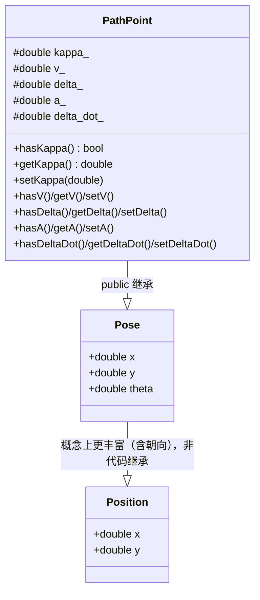
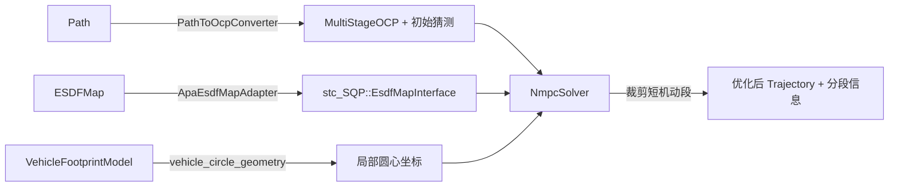
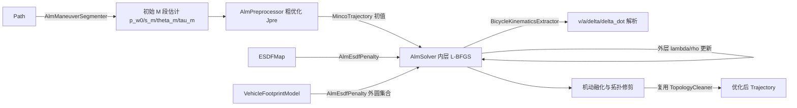
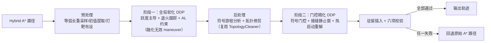
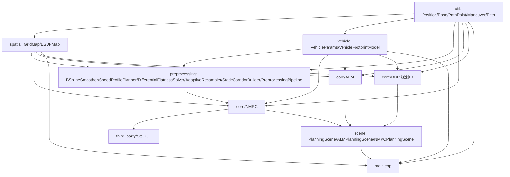
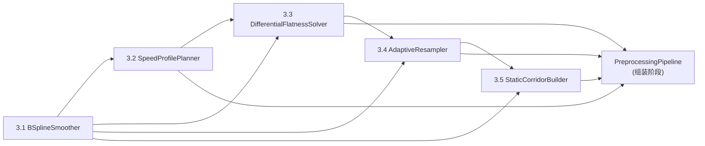

# 系统设计文档

## 1. 问题定义

APAPostProcessor 是一个 **APA（Automated Parking Assist，自动泊车辅助）路径规划后处理器**：
输入上游路径搜索模块（如 Hybrid A*）产出的一条粗糙泊车路径、占据栅格环境与车辆物理参数，
输出一条经过平滑、满足车辆运动学约束、且与环境保持安全裕度的可执行轨迹。

明确边界（不做什么）：

- 不做感知、定位、地图构建：环境以离线的占据栅格（`GridMap`）形式给定。
- 不做上游路径搜索（不实现 Hybrid A* 等前端规划器），只接收其产出的初始 `Path` 作为输入。
- 不做实时闭环控制执行：输出的是离线优化后的轨迹，不负责下发给车辆控制器。
- 不做多种后处理算法的运行时切换框架：当前仓库聚焦"实现并比较不同后处理算法在同一场景下的表现"，
  各算法之间是并列的实现（详见第 4 节模块划分），而非插件式运行时策略。

## 2. 设计思路

整体是一条**分层流水线**：

1. **数据加载**：从 json 配置 + protobuf（`proto/apa_post_process.proto`）反序列化出车辆参数、
   环境栅格与初始路径（`util/data_loader.hpp` + 各数据结构的 `FromProto`）。
2. **环境建模**：占据栅格 `GridMap` → 连续符号距离场 `ESDFMap`（双线性插值 + 梯度），
   为后续碰撞约束/代价提供可微分的距离查询。
3. **车辆几何建模**：`VehicleParams`（物理参数）→ `VehicleFootprintModel`
   （用多个圆近似车辆内外轮廓，按航向角离散化为查找表），把非凸的车身多边形碰撞检测
   转化为多个"点到最近障碍物距离"查询，兼顾精度与求解效率。
4. **路径表示与预处理**：初始路径被组织为 `Path`（有序 `Maneuver` 序列，`Maneuver` 内部是
   同一运动方向下的 `PathPoint` 序列）。`Path::addPoint` 在插入时自动完成：
   过近点去重、超距点线性插值、前进/后退/原地转向的方向推断；曲率估计则延后到
   `finalize()` 中统一批量完成。
5. **NMPC 优化**：核心后处理算法之一，复用 `third_party/StcSQP`（一个与业务无关的通用 SQP/OCP
   数值优化引擎）。业务层只负责"物理语义 → 数值参数"的转换：
   - `PathToOcpConverter` 把 `Path` 转成 `MultiStageOCP` 描述 + 初始猜测轨迹；
   - `ApaEsdfMapAdapter` 把 `ESDFMap` 适配成 StcSQP 的 `EsdfMapInterface`；
   - `vehicle_circle_geometry::ExtractLocalCircleCenters` 把 `VehicleFootprintModel` 的圆心
     转成 StcSQP 碰撞约束所需的局部坐标；
   - `NmpcSolver` 编排整个求解流程，并在求解后执行机动段裁剪（合并 Hybrid A* 产生的冗余换挡）。
6. **可视化/导出**：`Visualizer` 用于调试期绘制路径、车辆轮廓等；结果最终可通过 `Path::toProto`
   导出。针对预处理管线（第 5 步 5 个阶段）自身的排障需求，`Visualizer` 另外提供一个
   面向管线全断面的诊断入口 `plotPipelineDiagnostics`：把此前封装在
   `PreprocessingPipeline::run` 局部变量中、执行完即销毁的各阶段中间产物（B 样条密集配点、
   逐点速度/加速度/转角/转角速度、重采样时间步长、静态走廊松弛量）按需透传出来，以
   2 行 3 列子图统一在同一物理弧长/索引轴上平行对比，替代此前只能靠打印日志或单独写
   一次性脚本排查管线内部数值问题的方式。该能力默认关闭（`enable_debug_output = false`），
   仅在显式开启时填充调试数据，不影响生产路径的内存占用，详见
   [docs/visualizer_for_preprocessing_pipeline.md](visualizer_for_preprocessing_pipeline.md) 完整设计。

关键设计取舍：

- **复用通用数值优化引擎而不重复造轮子**：StcSQP 对物理世界"一无所知"，只认识固定维度的矩阵/参数
  向量；所有泊车业务语义都在 `src/core/NMPC/` 里以"适配器"的形式单向注入，避免把业务概念污染进
  通用优化内核。
- **多圆近似代替精确多边形碰撞检测**：用有限个圆到最近障碍物的距离约束/代价近似车身占据区域，
  在数值优化中可微、计算量可控。
- **碰撞约束用软代价而非硬约束**：真实数据的初始猜测可能已经贴着障碍物（甚至瞬时违反安全裕度），
  硬约束会导致 QP 在第 0 次迭代就因不可行而直接求解失败；软代价保证可行域非空，只是违反时支付
  高额代价（详见 `NmpcSolverConfig::esdf_penalty_weight` 注释）。
- **路径的方向切分与曲率完全由 `Path` 自己用几何启发式推导**（纵向投影 + 外接圆法），不依赖
  上游标注，因为上游 Hybrid A* 等前端不保证提供这些信息、且格式可能不统一。
- **"位姿"与"路径点"是两个不同的领域概念，不应该用同一个类型承担**：`Pose` 是任意时刻/任意场景下
  的几何位姿（车辆瞬时位姿、可视化标注等），`PathPoint` 才是"路径规划输出的轨迹点"，多出的曲率
  `kappa` 是 `Path` 对外的派生量而非通用位姿属性。这一区分是 2026-07-06 讨论后确立的重构目标，
  详见第 3 节。
- **碰撞安全裕度已移除，改为纯数值容差**：外圆（Outer Circles）本身已超出车辆矩形轮廓边界，因此全管线统一移除物理安全裕度（原 5cm/8cm），改为仅使用数值容差（`EPSILON_PRECISE = 1e-6`，作为碰撞 margin 默认值生效）兜底浮点误差。详见 [docs/NMPC.md](NMPC.md) 2.1 节 $F_{collision}$ 条目。
- **`third_party/StcSQP` 按第三方依赖对待的原则存在一处显式例外**：第 4 节模块划分表已注明该引擎
  "不计入本仓库业务代码规范"，但 3.5 节所述的一段专项内部工程优化需要直接修改其内部实现以提升
  NMPC 求解性能。这类改动不修改其对外的 `MultiStageOCP`/`SQPSolver` 使用方式，且必须同步更新
  `third_party/StcSQP/design_document.md`/`AGENTS.md`（该框架自身的权威文档），因此按本仓库的
  常规变更流程跟踪、但不改变"StcSQP 内部编码风格由其自身 `AGENTS.md` 治理"这一前提——两边
  文档都要改，不能只登记在一处。
- **去虚拟化方案选 `std::variant` 而非 CRTP**：复核 acados（业界成熟 SQP/OCP 框架）架构后发现，其
  "零开销热循环"依赖的是离线 CasADi 代码生成（把具体问题在生成期固化为专属 C 代码），而非 C++
  模板；其运行时仍保留可配置的 module 类型选择（函数指针分发，与虚函数开销量级相当）。CRTP 要求
  某个位置的具体类型在编译期唯一确定，这与本仓库"运行时任意组合 box/corridor/ESDF 等约束类型、
  比较不同场景表现"的定位（见第 1 节）直接冲突；`Constraint`/`CostTerm` 的具体子类目前是一个很小的
  封闭集合（约束 4 个、代价 3 个），改用 `std::variant` + `std::visit` 能在保留运行时组合能力的同时，
  让编译器对分发出的具体类型函数体做完整内联，收益与 CRTP 同量级但改动面小得多。该方案已实际
  实现并 benchmark，但未观测到可解释的性能收益，最终评估结论为不采纳，详见 [docs/interfaces.md](interfaces.md) 与 [docs/known-limitations.md](known-limitations.md) 对应记录。

## 3. 抽象建模

### 3.1 基础几何类型的层次

- `Position`：二维坐标，用于占据栅格/ESDF 的原点、栅格中心等纯位置场景。
- `Pose`：位置 + 朝向 `theta`，代表"某一时刻的几何位姿"，例如可视化中车辆的瞬时姿态。
  用 `struct` 声明、字段全公开，代表这三个量**必然存在**，**不应该包含任何路径规划语境下
  才有意义的派生量**（如曲率、速度）。
- `PathPoint`：`public` 继承 `Pose`，新增一组**不一定存在**的派生量：
  - `kappa`（有向曲率，1/m）：唯一权威来源是 `Path` 内部的曲率估计算法（外接圆法）；
  - `v`（纵向速度，m/s）、`delta`（前轮转角，rad）：对应 NMPC 优化轨迹的状态量；
  - `a`（纵向加速度，m/s²）、`delta_dot`（前轮转角变化率，rad/s）：对应 NMPC 优化轨迹的
    控制量（每段最后一个点通常没有对应的控制量）。

  这些派生量默认值均为 `std::numeric_limits<double>::quiet_NaN()`（代表"尚未提供"，不用
  `0.0` 兼任哨兵值），且不裸露字段，只能通过 `hasXxx()`/`getXxx()`/`setXxx()` 三件套访问：
  `hasXxx()` 判断是否已设置，`getXxx()` 未设置时抛出 `std::logic_error`（未检查 `has` 就
  `get` 视为调用方逻辑错误）。`PathPoint` 用 `class`（而非 `struct`）声明并把这些字段放在
  `protected`，与 `Pose` 的 `struct` 全公开字段形成对比——用不同的语言机制表达
  "必然存在"与"不一定存在"这两种不同的存在性语义。

  proto 层（`proto/apa_post_process.proto`）中 `Path`/`Maneuver` 携带的点始终只使用
  `apa::post_processor::Pose`（`x`/`y`/`theta`），不新增字段承载这些派生量——它们只在
  C++ 进程内产生和消费，不需要持久化或跨进程传递。`Path::FromProto`/`toProto` 负责在
  `Pose`（proto 反序列化产物）与 `PathPoint`（`Path`/`Maneuver` 的内部存储类型）之间转换。

### 3.2 路径与机动段

- `Maneuver`：同一运动方向（`Direction::FORWARD`/`BACKWARD`/`PIVOT`/`UNKNOWN`）下的
  `PathPoint` 有序序列，是 `Path` 的最小分段单元。
- `Path`：`Maneuver` 的有序序列。对外提供基于"逐点追加"的构造方式（`addPoint`），内部维护：
  - 去重/插值：过近的点忽略，过远的点线性插值补点；
  - 方向推断：基于纵向投影与位移阈值，推断当前点相对上一参考点是前进/后退/原地转向；
  - 曲率估计：基于外接圆法，在一个滑动的距离窗口内取前后参考点计算有向曲率。**计算时机在
    所有点追加完成后，由 `finalize()` 统一批量完成**（而非 `addPoint()` 时增量刷新），
    避免"草稿曲率/最终曲率"两套状态并存的复杂度；`addPoint()` 追加的点在 `finalize()`
    之前 `hasKappa() == false`。

### 3.3 环境与车辆几何

- `GridMap`：离散占据栅格（0/1），提供物理坐标 ↔ 栅格索引的双向映射。
- `ESDFMap`：基于 `GridMap` 构建的欧式符号距离场（Felzenszwalb & Huttenlocher 算法），
  对外提供任意物理坐标处的符号距离与梯度（双线性插值），供 NMPC 碰撞约束/代价使用。
- `VehicleParams`：车辆物理参数（长宽轴距、最大转向角等），并派生出最大曲率 `max_kappa`。
- `VehicleFootprintModel`：把车身用内圈（保守近似，供内缩/软代价场景）与外圈
  （完整覆盖车身，供硬碰撞安全裕度场景）两组圆的查找表来近似，按航向角离散采样预先构建，
  运行时对任意 `(x, y, theta)` 做插值即可得到圆心坐标与对应的雅可比。

### 3.4 NMPC 优化领域模型

`NmpcSolver::Result` 携带优化后的状态/控制轨迹、每段步数与方向符号，供调用方按段切回
`Maneuver` 结构（如 `NmpcSolver::ToPath` 的逆向组装）。

### 3.5 StcSQP 框架内部工程优化

对 [docs/NMPC.md](NMPC.md) 第 5 章"C++ 框架底层工程优化指南"逐条核对 `third_party/StcSQP` 实际
代码后发现：RK4 积分精度（5.1 节）、HPIPM 原生软约束（5.3 节）、`linearize()` 的 OMP 并行（5.4 节
上半）均已落地；真正存在的具体缺口是文档未提及、但代码复核中确认的三处，按风险从低到高拆分为
三项独立的优化工作：

| 名称 | 核心内容 | 风险 |
|---|---|---|
| StcSQP 热循环基础设施优化 | 补齐 `stc_SQP_core_lib` 的 `-march=native`；`CostTerm` 新增组合求值接口消除 `CircleFootprintEsdfPenaltyCost` 等重复 ESDF 查询；`assembleQP()`/`assembleCost()` 补齐与 `linearize()` 对称的 OMP 并行 | 低（无对外语义变化） |
| HPIPM IPM 跨迭代热启动 | `HPIPMQPSolver::setWarmStart()` 从空实现改为真正的 IPM warm start，`SQPSolver::solveQP()` 在 Full SQP 循环内跨迭代复用上一次解 | 中（涉及数值收敛行为，需 benchmark 佐证） |
| `Constraint`/`CostTerm` 虚函数多态迁移到 closed-set `std::variant` | 见上方"去虚拟化方案选 `std::variant`"设计取舍 | 高（架构级改动，是否合入以 benchmark 数据为唯一判据） |

三项工作均以 `third_party/StcSQP/bench/bench_performance_profiling.cpp`（**StcSQP 框架自身的
benchmark，与主仓库 `bench/bench_apa_post_processor` 是两套独立的压测目标，不要混淆**）的实测数据
作为"是否达成优化目标"的唯一依据，不预设具体的性能提升百分比指标。详见
[docs/interfaces.md](interfaces.md) 中登记的 StcSQP 框架内部接口变更记录。

### 3.6 NMPC 算法最终重构：接入预处理参考轨迹与四数据集调参收敛

预处理管线与 `third_party/StcSQP` 内部工程优化均已完成，但 `src/core/NMPC/`
（`NmpcSolver`/`PathToOcpConverter`）与 `src/main.cpp` 生产入口至今仍未真正消费预处理管线的产出——
`PathToOcpConverter::convert()` 内部仍自行对每个 Maneuver 重新猜测一条简化的三次多项式速度剖面并由
曲率反推前轮转角，完全没有使用 `SpeedProfilePlanner`/`DifferentialFlatnessSolver` 已经算好的、精度
更高的速度/转角/非均匀时间步长（`delta_t`）；`stc_SQP::StageSegment` 已原生支持的 `dt_array`（非均匀
步长）字段也从未被业务层使用过（详见 [docs/known-limitations.md](known-limitations.md)"`main.cpp`
生产入口尚未接入 `PreprocessingPipeline`"条目）。这是本次重构系列要弥合的核心架构差距。

启动本系列前，对 [docs/NMPC.md](NMPC.md) 第 2~4 节问题定义与数学建模做了一次新的复核，确认此前一次
全局质量校验（碰撞安全裕度统一、静态走廊信赖域约束）修复的问题仍然有效；具体的逐条复核结论已落地
为代码变更，记录于 [docs/interfaces.md](interfaces.md) 的变更记录中，而非在本文件重复展开。

按"先体检现有框架、再接线、再调参、最后收尾"的顺序拆分为四个存在严格前置依赖的阶段：

| 名称 | 核心内容 |
|---|---|
| NMPC 现有实现框架代码质量与架构复核重构 | 不接入预处理管线的纯内部重构：确认 `PathToOcpConverter`/`NmpcSolver` 的职责边界（简化初始猜测 vs 精确 Warm Start 的职责重叠）、为 `NmpcSolver` 补一个接受预装配 OCP/初始猜测的扩展点、核对 cpp-style.md 合规性；行为不变，全量既有测试保持通过 |
| 预处理管线接入 NMPC（Warm Start 重构与失败兜底） | 新增消费 `PreprocessingPipelineResult`（`z_ref`/`delta_t`/`c_matrix`/`d_vector`）的转换路径，通过上一阶段的扩展点接入 `NmpcSolver`；`main.cpp` 切换为 `Path → PreprocessingPipeline → NmpcSolver` 完整链路；实现"NMPC 失败但预处理成功时回退使用预处理轨迹"的兜底 |
| 四数据集调参与自适应间隔重试 | 在四份真实数据集上调参收敛（换挡数/长度/可视化三重判据）；实现"预处理密集采样间隔拉长重试、用完必须恢复默认值（不得污染共享默认配置）"的自适应策略 |
| 端到端验收与收尾 | 系列级端到端回归 + 相关文档收尾 |

四份代表性数据（对应用户"尽量在四个问题中都取得较好表现"的验收诉求）为：
[data/mid_park/data3.json](../data/mid_park/data3.json)、
[data/rub_park/data1.json](../data/rub_park/data1.json)、
[data/rub_park/data7.json](../data/rub_park/data7.json)、
[data/long_park/data6.json](../data/long_park/data6.json)。"较好的表现"用
`main.cpp` 已有的日志（换挡数与总长度前后对比）+ `Visualizer` 生成的路径对比图（`fig/` 目录）
综合判定，具体量化阈值由四数据集调参阶段结合实测结果确定。

模块依赖关系图（第 4 节）已随预处理管线接入 NMPC 完成更新为真实链路：
NMPC 路径的数据流经由 `preprocessing` 摄入 `PreprocessingPipeline` 的输出，再由
`core/NMPC/PreprocessingToOcpConverter` 转换为 `MultiStageOCP` + Warm Start 后交给
`NmpcSolver`。`main.cpp` 生产入口已改为只接入 ALM 路径（见 3.7 节），不再直接消费
NMPC 链路的任何产出，编译期依赖图中不再保留 `nmpc --> main`/`preprocess --> main` 边，
NMPC 路径继续由 `NMPCPlanningScene`、单元测试与 benchmark 独立调用。

### 3.7 ALM/MINCO/PHR-ALM 优化领域模型

作为与 3.4 节 NMPC 并列的第二条后处理算法路径，`src/core/ALM/` 面向同一 APA 场景实现一套
完全独立的时空轨迹优化方法：把车辆轨迹参数化在“运动状态空间”（朝向角 $\theta$、弧长 $s$）
而非笛卡尔坐标下，用 MINCO 多项式降维 + PHR-ALM（Powell-Hestenes-Rockafellar 增广拉格朗日）
外层精确收紧终点误差，彻底改造自浙江大学 FAST Lab 的通用差速机器人轨迹优化框架（arXiv:2409.07924），
并针对本仓库的阿克曼自行车模型、齿轮挡位、Hybrid A* 前端重新推导。完整数学原理见
[docs/ALM.md](ALM.md)（第一章为原论文理论框架，第二章为本仓库自行车模型下的 APA 重新推导），本节
只做架构层面的领域模型概述。

领域模型划分（与 3.4 节 NMPC 一一对照，体现两条算法路径职责边界一致但内部实现完全独立）：

- `MincoTrajectory`：$\theta_i(t)/s_i(t)$ 多项式段表示，封装 $K(T)c=b$ 装配、块 Thomas 求解、
  时间重参数化 $\tau \leftrightarrow T$ 双射以及终点弧长 $s_f$ 的伴随梯度（对应 [docs/ALM.md](ALM.md) 1.2 节）。
- `BicycleKinematicsExtractor`：从 `MincoTrajectory` 的 $\theta,s$ 各阶导数解析阿克曼状态/控制量
  （$v,a,\delta,\dot\delta$）与对应的防奇异物理约束惩罚（对应 2.2/2.3 节）。
- `AlmManeuverSegmenter`：复用 `Path`/`Maneuver`，实现换挡打断（宏观段）与空间等距降采样（微观段），
  产出初始 $M$ 段估计（对应 2.1 节）。
- `AlmEsdfPenalty`：复用 `ESDFMap`/`VehicleFootprintModel` 外圆集合，实现 `margin_safe`/`margin_comf`
  双重松弛罚函数与梯度反传（对应 2.4 节）。
- `AlmPreprocessor`：两阶段优化流程的第一阶段，松收敛阈值下把初值拉近前端路径（对应 1.2/2.1 节
  “两阶段优化流程”）。
- `AlmSolver`：与 `NmpcSolver` 并列的求解器编排入口，内层 L-BFGS（复用 `third_party/LBFGSpp`，
  参照 `BSplineSmoother` 的 `operator()(x, grad)` 手写解析梯度范式）+ 外层 PHR-ALM 乘子/惩罚权重
  更新，输出满足终点精度与无碰撞/无奇异要求的解析轨迹（对应 1.4/2.5 节）。
- 机动融化后的拓扑修剪直接复用既有 `util::topology_cleaner`（对应 2.6.3 节红线：“绝不合并方向
  相反的相邻段”，与 NMPC 侧共享同一套判据）。

该路径已全部落地并接入生产后处理器：`PostProcessor::optimizeAlm()` 把上述组件编排为
`Path → AlmManeuverSegmenter → AlmPreprocessor → AlmSolver → AlmManeuverMelter` 完整链路，
与既有 NMPC 路径并列、互不影响（运动学配置由 `VehicleParams` 统一派生，碰撞质量门 0.02 m
两条路径共享）。四数据集端到端验收与 NMPC 的对比结果见 [docs/ALM.md](ALM.md) 第三章。
`main.cpp` 生产入口只构造并执行 `ALMPlanningScene`，用 `Visualizer` 生成 **ALM 预处理粗优化
轨迹（优化前）与 ALM 主优化 + 机动融化后轨迹（优化后）** 的对比图：两条轨迹由同一套离散化
工具（`SampleMincoTrajectory`，`src/core/ALM/alm_trajectory_sampler.h`）产出，是同一条 θ-s
管线内部真正意义上的"优化前/优化后"对比；`main.cpp` 不再构造或调用 `NMPCPlanningScene`
（NMPC 路径本身保留，仍可经 `NMPCPlanningScene`/`PostProcessor::optimize` 独立调用）。

**收尾与独立化进展（见 [docs/milestones.md](milestones.md)）**：一次代码
复核发现 `AlmManeuverMelter` 的 `PIVOT` 处理与自行车模型自相矛盾（详见
[docs/known-limitations.md](known-limitations.md) 对应条目与 [docs/ALM.md](ALM.md) 3.4 节），
该问题已修复；`main.cpp` 此前需要运行一次完整 NMPC 求解才能获取其预处理管线
产出作为对比基线，现已改为直接对比 ALM 自身"预处理粗优化轨迹"与"主优化+机动
融化后轨迹"（离散化能力从 `AlmManeuverMelter` 拆出为独立工具 `SampleMincoTrajectory`），
`main.cpp` 不再依赖 `NMPCPlanningScene`，ALM 成为真正独立的优化器；
此外已为 `Trajectory::validate()` 补充基于梯形配点残差的运动学可行性校验，与既有
碰撞安全/终点收敛两项校验并列（Δt 过大的换挡停驻补丁步因 O(Δt³) 截断主导而跳过，
标定依据见 [docs/interfaces.md](interfaces.md) 变更记录）；
最后完成四数据集调参：ALM 采样轨迹补齐时间戳使运动学门对其生效、
运动学门适配换挡尖点低速伪影后，`weight_jerk_s`（1.0→5.0）与 `weight_gear_cusp`
（1000.0→50.0）经 25 组变体扫描标定为新默认值——四数据集全部满足"运动学可行 +
碰撞安全 + 终点收敛"三门，段数 ≤ 既有基线（3/2/2/4 段）、长度全面低于既有基线
（11.77/6.98/13.87/27.80 m），过程与批次数据见 [docs/ALM.md](ALM.md) 第四章。

### 3.8 DDP（MS-iLQR + AL）优化领域模型（第三条算法路径，求解链路已落地、端到端调参进行中）

与 3.4 节 NMPC、3.7 节 ALM 并列的第三条后处理算法路径，完整数学推导与工程约定见
[docs/DDP.md](DDP.md)（理论基础：Tassa 2014 Box-DDP、Howell 2019 ALTRO、Li 2023
Unified MS-DDP 三篇论文的机制拼装）。核心定位：**内层 MS-iLQR（Gauss-Newton，缺陷
感知回推 + 非线性滚动）消化混合 A\* 注入的状态初值；每个回推步用 box-QP 精确处理控制
盒约束（严禁 clamping/squashing）；一般状态约束、ESDF 避障与终点对齐交给 ALTRO 式
AL 外层渐硬收紧**。由此天然满足「轨迹恒动力学可行、初值直接可注入、控制硬限不软化」
三项 APA 后处理核心诉求。

**与既有两条路径的建模差异**：

- 参数化：不再是 ALM 的 θ-s 多项式（时间为优化变量），而是固定 $dt=0.1\,\text{s}$、
  $N=399$ 步的离散状态链——七维状态 $x=[x,y,\theta,v,a,\delta,\omega]^T$、二维控制
  $u=[j,\eta]^T$，半隐式 Euler + 中点朝向角积分（无偏、二阶旋转精度），$\delta$ 为显式
  状态从根上消除 ALM 的 0/0 奇异反解；代价中无时间项，时间效率交下游速度重规划兜底。
- 换挡建模：Reeds-Shepp 有符号速度观点，档位不是决策变量，cusp 处**不施加 $v=0$ 硬边界**
  （对照 ALM 的结构性 $\dot s_k=0$ 边界）——速度可全程不变号连续穿过原换挡点，这是
  「在连续优化内部融化无效 maneuver」的结构性前提；档位由后处理按 $\mathrm{sign}(v)$ 恢复。
- 初值注入：多重打靶（打靶节点 = 每 $n_s$ 步 ∪ cusp ∪ 末点），打靶状态是独立决策变量、
  允许初始缺陷 $d\neq0$，直接吸收 A\* 的「只知其形」初值；线搜索用带自适应罚 $\mu_m$ 的
  merit function（与 AL 罚权重 $\mu$ 严格独立）。

**三阶段流程**：

**规划中的组件划分**（`src/core/DDP/`，接口规划见 [docs/interfaces.md](interfaces.md)，
Milestone 拆分见 [docs/milestones.md](milestones.md)）：

- 预处理/参考构建：等弧长重采样到 0.05 m、cusp 检测、差分初值提取、打靶节点布设（对应 DDP.md 2.1 节）。
- 七维自行车动力学：半隐式 Euler + 中点朝向角离散化、解析雅可比 $A_k/B_k$，可选完整二阶张量
  编译期开关（对应 2.2/2.5 节）。
- box-QP 求解器：投影牛顿 + 活动集热启动，返回自由维 Hessian 分解（对应 1.2/2.4 节）。
- 代价/约束求值层：平滑主项、退火跟踪、可选换挡代理、状态幅值平方 AL 不等式、ESDF 双 margin
  惩罚（复用 `ESDFMap`/`VehicleFootprintModel` 外圆集合与 discretize-then-differentiate 约定）、
  终点 AL 等式（对应 2.3/2.4 节）。
- MS-iLQR 内层：缺陷感知 Riccati 回推（右端索引约定）、LM 正则化调度、线性 rollout 缓存
  $EC_1/EC_2$ + 非线性 rollout 线搜索、可选段间惩罚（对应 1.4/2.5 节）。
- AL 外层与求解编排：自适应 $\mu^0$、门控增长、跟踪权重退火、阶段一/阶段二统一入口（对应 2.5 节）。
- 后处理：符号游程分析（滞回）、拓扑修剪（复用 `util::topology_cleaner`，红线同 ALM）、逐接缝
  $T_{resteer}$ 驻留插入、校验清单与回退（对应 2.6 节）。
- 场景接入（已落地）：`PostProcessor::optimizeDdp()` 编排入口 + `DDPPlanningScene` + `data/ddp_config.json`
  （`"algorithm"` 路由字段，沿用 3.7 节确立的「每算法一个配置详情 JSON」约定）。

性能画像（DDP.md 2.5 节复杂度评估）：纯求解每轮 $O(N(n^3+\dots))\approx10^6$ 标量运算，
微秒~毫秒级；**运行时被 ESDF 查询主导**，插值缓存友好性是第一优化对象；SoA 存储 +
Eigen 对齐分配器 + 严禁热循环堆分配为强制实现规范。

## 4. 模块划分

| 模块 | 路径 | 职责 |
|---|---|---|
| 基础工具层 | `src/util/` | `Position`/`Pose`/`PathPoint`/`Maneuver`/`Path` 等核心数据结构，`Logger`、`DataLoader`、`Visualizer`、常量定义 |
| 环境表示 | `src/spatial/` | `GridMap`（占据栅格）、`ESDFMap`（符号距离场）；`sfc_corridor.h/.cpp` 当前为空文件，是规划中的安全飞行走廊（Safe Flight Corridor）模块，**尚未实现** |
| 车辆几何 | `src/vehicle/` | `VehicleParams`（物理参数）、`VehicleFootprintModel`（多圆近似车身占据） |
| 后处理算法核心 | `src/core/` | 承载具体后处理算法实现；`obb_inflator.h/.cpp` 当前为空文件，是规划中的 OBB（有向包围盒）膨胀算法模块，**尚未实现** |
| NMPC 子模块 | `src/core/NMPC/` | `ApaEsdfMapAdapter`（ESDF 适配器）、`vehicle_circle_geometry`（圆心几何提取）、`PathToOcpConverter`（Path→OCP 转换）、`PreprocessingToOcpConverter`（预处理管线输出 → OCP + Warm Start，M020）、`NmpcSolver`（求解编排 + 机动段裁剪）、`ThetaTrustRegionConstraint`（信赖域约束，M012）、`StaticCorridorLinearConstraint`（静态走廊线性不等式约束，M012），基于 `third_party/StcSQP` 实现 |
| 预处理管线 | `src/preprocessing/` | NMPC 预处理管线：分 5 个独立阶段类（`BSplineSmoother`/`SpeedProfilePlanner`/`DifferentialFlatnessSolver`/`AdaptiveResampler`/`StaticCorridorBuilder`）+ 1 个组装类（`PreprocessingPipeline`），对应 [docs/NMPC.md](NMPC.md) 第 3 节，把 Hybrid A* 粗糙路径转换为动力学平滑、拓扑安全的 Warm Start；各阶段均已落地 |
| ALM 子模块 | `src/core/ALM/` | 与 `NMPC` 子模块并列的第二条后处理算法路径（已落地并接入 `PostProcessor::optimizeAlm`）：`MincoTrajectory`（多项式轨迹与 $K(T)$ 求解）、`BlockTridiagonalSolver`（块 Thomas 求解器）、`BicycleKinematicsExtractor`（阿克曼状态解析）、`AlmManeuverSegmenter`（前端解析与分段）、`AlmEsdfPenalty`（双重安全惩罚）、`AlmPreprocessor`（预处理粗优化）、`AlmSolver`（PHR-ALM 主求解器）、`SampleMincoTrajectory`（θ-s 轨迹离散化工具）、`AlmManeuverMelter`（机动融化与拓扑修剪），详见 3.7 节与 [docs/ALM.md](ALM.md) |
| DDP 子模块 | `src/core/DDP/` | 与 NMPC/ALM 并列的第三条后处理算法路径（Milestone 001~008 已落地并接入 `PostProcessor::optimizeDdp`，端到端调参见 [docs/milestones.md](milestones.md)）：`DdpReferenceBuilder`（预处理/参考构建）、`BicycleDynamics`（七维自行车动力学与解析雅可比）、`BoxQpSolver`（投影牛顿）、`DdpCostEvaluator`/`DdpEsdfConstraint`（代价/约束求值层）、`MsIlqrSolver`（内层）、`AlOuterLoop`/`ApaDdpSolver`（AL 外层与求解编排）、`DdpPostStage`（后处理与门控精化），详见 3.8 节与 [docs/DDP.md](DDP.md) |
| 场景组装 | `src/scene/` | `PlanningScene` 基类（持有一次后处理任务的完整上下文：环境+车辆+路径+配置）与三个并列场景实现：`NMPCPlanningScene`（NMPC 链路）、`ALMPlanningScene`（ALM 链路，效仿前者结构）、`DDPPlanningScene`（DDP 链路，同结构）；基类静态工厂 `LoadFromFile` 按场景配置的 `config_details_path` 所指详情 JSON 的 `"algorithm"` 字段运行时路由场景。配置约定：**每个算法一个配置详情 JSON**（`data/alm_config.json`/`data/nmpc_config.json`/`data/ddp_config.json`，含 `"algorithm"` 路由字段与算法字段覆盖项），场景级 `data/config.json` 只承载 `data_file_path` 与 `config_details_path`，切换算法只改后者；算法无关的基类字段覆盖项由 `src/util/config_loader.h` 统一解析（当前映射 `outer_row_num`） |
| 通用 SQP/OCP 引擎（第三方） | `third_party/StcSQP/` | vendored 的通用数值优化框架，对物理世界无感知，通过固定维度参数向量与业务层交互；按第三方依赖对待，不计入本仓库业务代码规范（该框架自身的编码风格由 `third_party/StcSQP/AGENTS.md`/`design_document.md` 治理）；3.5 节所述的一段内部工程优化是本仓库主动发起、对其内部实现的性能优化，改动需同步更新该框架自身文档 |
| 测试 | `test/` | 单元测试，命名 `*.t.cpp` |
| 压测 | `bench/` | 性能压测，命名 `bench_*.cpp`，入口 `bench/main.bench.cpp` |

模块依赖关系：

`scene --> main` 边为编译期直接依赖：`main.cpp` 只包含 `ALMPlanningScene`
（`alm_planning_scene.h`）与 `util` 头文件，经场景层接入 ALM 路径；`alm --> scene`/
`nmpc --> scene` 为场景层对两条算法路径的并列依赖（`planning_scene.h` →
`post_processor.h` → ALM/NMPC 头文件）。`main.cpp` 不再直接调用 NMPC 链路，
`nmpc --> main`/`preprocess --> main`/`alm --> main` 边已随 `main.cpp` 去除 NMPC 依赖的改造移除；
NMPC 路径继续由 `NMPCPlanningScene`、单元测试与 benchmark 独立调用。

`preprocessing_pipeline` 内部 5 个阶段严格按 [docs/NMPC.md](NMPC.md) 第 3.1~3.5 节顺序单向依赖，最终由组装阶段的 `PreprocessingPipeline` 编排：

## 5. 核心接口契约

详见 [docs/interfaces.md](interfaces.md)（本节只做概述性索引，具体签名以该文件链接的头文件为唯一真值，不在此重复代码）。

## 变更记录

| 日期 | 变更内容 |
|---|---|
| 2026-07-06 | 首次补全全系统架构文档；确立 `Pose`（纯位姿）与 `PathPoint`（`Pose` + 曲率）的职责拆分设计，替代此前 `Pose` 直接承载 `kappa` 的耦合方案 |
| 2026-07-06 | `PathPoint` 设计细化：新增 `v`/`delta`/`a`/`delta_dot` 四个 NMPC 状态/控制派生量（默认 NaN，`has/get/set` 三件套访问）；确认 proto 层不携带这些派生量；`Path` 的曲率计算时机从 `addPoint()` 增量刷新改为 `finalize()` 统一批量计算 |
| 2026-07-06 | 新增"预处理管线"规划：`src/preprocessing/` 模块划分（5 个独立阶段 + 1 个组装阶段），对应 [docs/NMPC.md](NMPC.md) 第 3 节；新增模块依赖流程图 |
| 2026-07-07 | 复核 `docs/NMPC.md` 第 3 节数学原理，发现碰撞安全裕度跨阶段数值不自洽（3.1 节 5cm vs 3.5/4.3 节 8cm）与静态走廊线性化缺少信赖域约束两项问题；已在 `docs/NMPC.md` 补充统一符号与 $\Delta\theta$ 信赖域推导 |
| 2026-07-07 | 新增"预处理管线可视化诊断"设计：`Visualizer` 扩展 `plotPipelineDiagnostics` 入口，2x3 子图统一排障预处理管线 5 个阶段的中间产物；`PreprocessingPipelineConfig`/`PreprocessingPipelineResult` 新增调试数据透传开关；完整设计见 [docs/visualizer_for_preprocessing_pipeline.md](visualizer_for_preprocessing_pipeline.md) |
| 2026-07-09 | benchmark 排查确认预处理管线耗时大头在 `BSplineSmoother`（第 5 节"预处理管线"模块）：落地文档 5.5 节已设计但未落地的密集配点 OMP 并行化，并对 L-BFGS 收敛参数（`lbfgs_max_iterations`/`lbfgs_max_linesearch`）按调参-验证-回滚流程做安全范围内的收紧探索；纯内部实现优化，不改变 `BSplineSmoother`/`BSplineSmootherConfig` 对外签名 |
| 2026-07-09 | 启动"NMPC 算法最终重构"系列：新增第 3.6 节（框架审查重构→预处理管线接入 NMPC→四数据集调参与自适应间隔重试→端到端验收收尾），弥合"预处理管线已完成但 `main.cpp`/`NmpcSolver` 从未真正消费其输出"的架构差距 |
| 2026-07-09 | 完成 `src/core/NMPC/` 框架审查与解耦重构：`PathToOcpConverter` 拆分为 `computeSegmentProfiles()`/`generateInitialGuess()`/`buildOcp()`，`NmpcSolver` 新增 `optimize(MultiStageOCP, Trajectory, ESDFMap)` 扩展点；非均匀 `delta_t` 已预留 `SegmentProfile::dt_array`/`StageSegment::dt_array` 但未接入，留给后续接线 |
| 2026-07-19 | 新增第二条后处理算法路径规划：3.7 节 ALM/MINCO/PHR-ALM 优化领域模型（与 3.4 节 NMPC 并列，彻底改造自 arXiv:2409.07924）；第 4 节模块划分表新增 `src/core/ALM/` 行；具体 Milestone 拆分见 [docs/milestones.md](milestones.md)，接口规划见 [docs/interfaces.md](interfaces.md) |
| 2026-07-21 | ALM 路径全部落地并接入 `PostProcessor`：3.7 节标题移除"规划中"标记、收尾段落更新为真实链路（`PostProcessor::optimizeAlm` 编排五大组件，与 NMPC 路径并列互不干扰，`main.cpp` 生产入口行为不变）；第 4 节模块划分表 `src/core/ALM/` 行更新为已实现组件清单；模块依赖图新增 `core/ALM` 节点与 `alm --> main` 传递依赖边；四数据集验收对比见 [docs/ALM.md](ALM.md) 第三章 |
| 2026-07-21 | `main.cpp` 生产入口接入 ALM 路径：新增 `ALMPlanningScene`（效仿 `NMPCPlanningScene`），main 同时执行两条路径并生成三条轨迹对比图；第 4 节模块划分表"场景组装"行更新为 `PlanningScene` 基类 + 两个并列场景实现（顺带修正该行"空文件尚未实现"的过期描述）；3.7 节收尾段落同步更新 |
| 2026-07-21 | `main.cpp` 对比图内容调整：只绘制预处理轨迹与 ALM 优化轨迹两条，NMPC 优化结果不再纳入横向对比（NMPC 场景仅为产出预处理轨迹保留）；3.7 节收尾段落同步 |
| 2026-07-22 | 一次代码复核发现 `AlmManeuverMelter` 的 `PIVOT` 处理与自行车模型自相矛盾，立项"收尾与独立化"系列改造（PIVOT 修复→`main.cpp` 改为对比 ALM 自身预处理/优化后轨迹并去除对 NMPC 的依赖→`Trajectory::validate()` 新增运动学可行性校验→四数据集调参）；3.7 节收尾段落新增规划说明，接口层面的计划变更登记见 [docs/interfaces.md](interfaces.md)，PIVOT 问题分析见 [docs/known-limitations.md](known-limitations.md) 与 [docs/ALM.md](ALM.md) 3.4 节 |
| 2026-07-22 | `main.cpp` 移除对 `NMPCPlanningScene` 的依赖：离散化能力从 `AlmManeuverMelter` 拆出为独立纯函数工具 `SampleMincoTrajectory`（新增 `src/core/ALM/alm_trajectory_sampler.h/.cpp`），`PostProcessorResult` 新增 `alm_preprocessed_traj` 字段、`ALMPlanningScene` 新增 `almPreprocessedTraj()` 访问器；对比图改为 ALM 自身"预处理粗优化轨迹（优化前） vs 主优化+机动融化后轨迹（优化后）"；3.7 节收尾段落与规划进展、3.6 节依赖说明、第 4 节模块划分表（ALM 行新增离散化工具）与模块依赖图（新增 `scene` 节点，移除 `nmpc --> main`/`preprocess --> main`/`alm --> main` 边）同步更新 |
| 2026-07-22 | `Trajectory::validate()` 新增第三门"运动学可行性"校验（梯形配点残差，详见 [docs/interfaces.md](interfaces.md) 变更记录的标定依据）；前置修复：`NmpcSolver::ToPath`/`PostProcessor::runSingleAttempt` 对状态增广结果的 `a`/`delta_dot` 回填张冠李戴（误从控制序列取 jerk/转向角加速度）按状态维度分支修正，`VehicleFootprintModel` 新增 `getWheelbase()` 只读访问器 |
| 2026-07-22 | 四数据集调参完成：ALM 采样轨迹补齐时间戳（运动学门对 ALM 产出生效的前置）、运动学门新增低速跳过适配换挡尖点伪影、`AlmSolverConfig::weight_jerk_s`（1.0→5.0）与 `weight_gear_cusp`（1000.0→50.0）默认值标定，四数据集全部满足三门合法性且段数/长度全面优于既有基线；新增 `tool/tune_alm.cpp` 调参驱动工具与 `apa_tune_alm` 构建目标，[docs/ALM.md](ALM.md) 第四章验收总表同步更新（新增"运动学可行"列） |
| 2026-07-28 | 新增第三条后处理算法路径规划：3.8 节 DDP（MS-iLQR + AL）优化领域模型（与 3.4 节 NMPC、3.7 节 ALM 并列，理论与工程约定见 [docs/DDP.md](DDP.md)）；第 4 节模块划分表新增 `src/core/DDP/` 行、模块依赖图新增 `core/DDP` 节点；Milestone 拆分（001~009）见 [docs/milestones.md](milestones.md)，接口规划见 [docs/interfaces.md](interfaces.md) |
